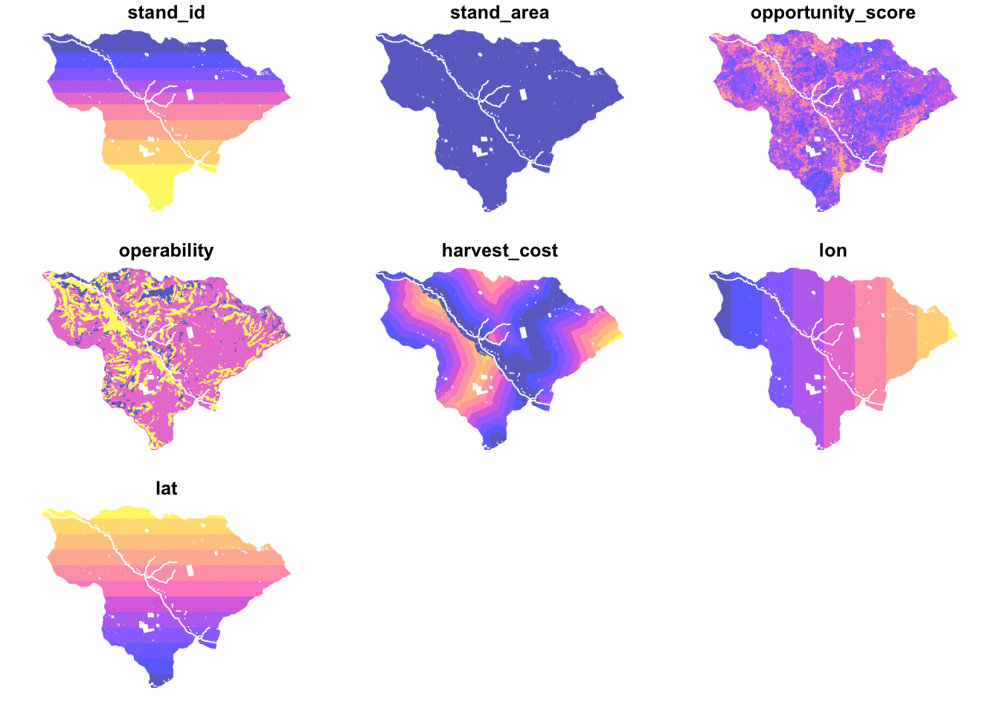
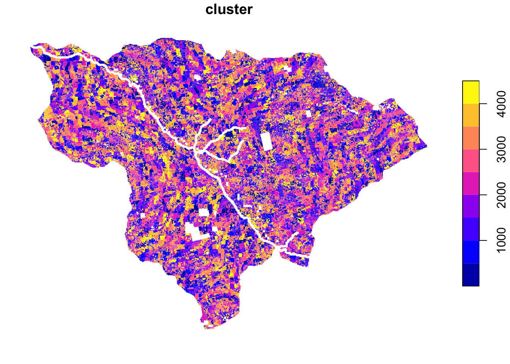
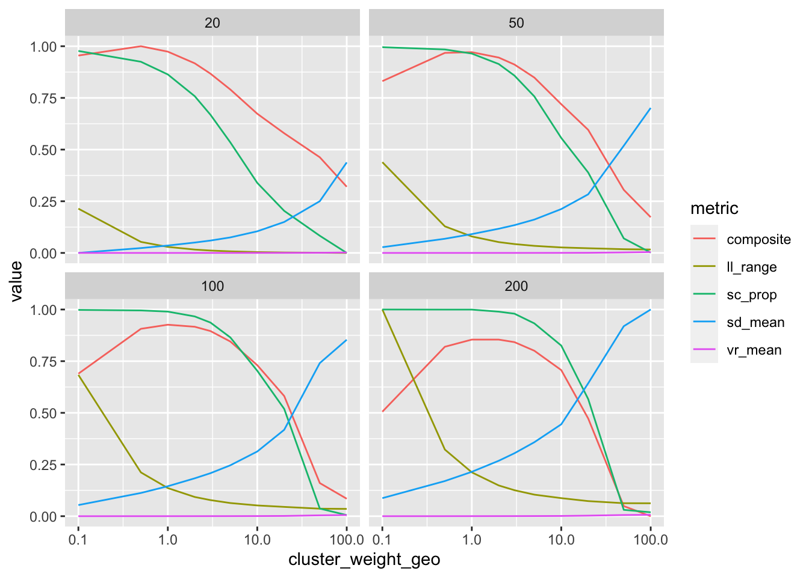
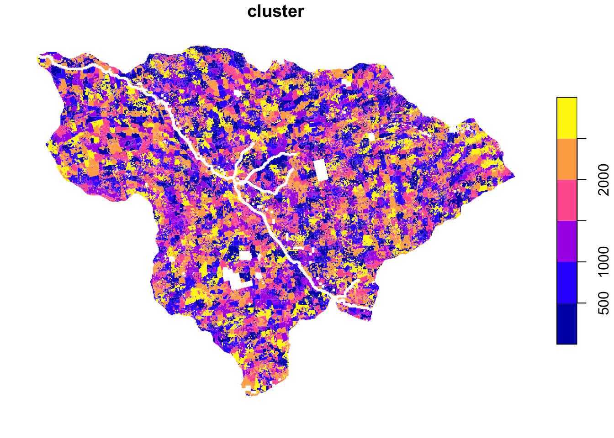
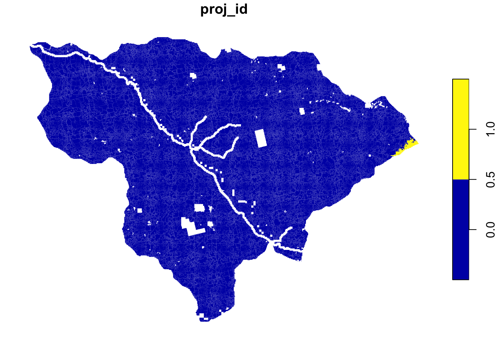
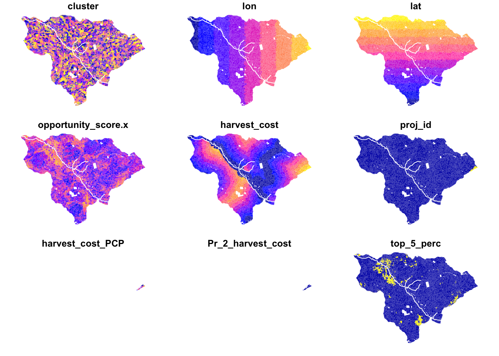

ForSys TCSI testing
================
Laurens Geffert
2022-11-21

<!-- forsys_tcsi_testing.md is generated from forsys_tcsi_testing.Rmd. Please edit that file -->

RScript for a test analysis of a single HUC12 in the TCSI area. The
purpose of this script is to explore and illustrate the running of
ForSysR in a real-world example using actual input data, so that we can
understand the program API, input parameters, outputs, and estimate
runtime.

``` r
#' To install ForSysR and Patchmax from GitHub:
#' library(jsonlite)
#' library(devtools)
#' 
#' # Installation needs access to private repository
#' github_token <- read_json('analysis/code/.access_codes')$github
#' 
#' install_github("forsys-sp/forsysr", auth_token=github_token)
#' install_github("forsys-sp/patchmax", auth_token=github_token)

library(forsys)
## Loading required package: rlang
library(sf)
## Linking to GEOS 3.10.2, GDAL 3.4.2, PROJ 8.2.1; sf_use_s2() is TRUE
library(raster)
## Loading required package: sp
library(tidyverse)
## ── Attaching packages
## ───────────────────────────────────────
## tidyverse 1.3.2 ──
## ✔ ggplot2 3.3.6      ✔ purrr   0.3.5 
## ✔ tibble  3.1.8      ✔ dplyr   1.0.10
## ✔ tidyr   1.2.1      ✔ stringr 1.4.1 
## ✔ readr   2.1.3      ✔ forcats 0.5.2 
## ── Conflicts ────────────────────────────────────────── tidyverse_conflicts() ──
## ✖ purrr::%@%()         masks rlang::%@%()
## ✖ purrr::as_function() masks rlang::as_function()
## ✖ tidyr::extract()     masks raster::extract()
## ✖ dplyr::filter()      masks stats::filter()
## ✖ purrr::flatten()     masks rlang::flatten()
## ✖ purrr::flatten_chr() masks rlang::flatten_chr()
## ✖ purrr::flatten_dbl() masks rlang::flatten_dbl()
## ✖ purrr::flatten_int() masks rlang::flatten_int()
## ✖ purrr::flatten_lgl() masks rlang::flatten_lgl()
## ✖ purrr::flatten_raw() masks rlang::flatten_raw()
## ✖ purrr::invoke()      masks rlang::invoke()
## ✖ dplyr::lag()         masks stats::lag()
## ✖ dplyr::select()      masks raster::select()
## ✖ purrr::splice()      masks rlang::splice()
library(magrittr)
## 
## Attaching package: 'magrittr'
## 
## The following object is masked from 'package:purrr':
## 
##     set_names
## 
## The following object is masked from 'package:tidyr':
## 
##     extract
## 
## The following object is masked from 'package:raster':
## 
##     extract
## 
## The following object is masked from 'package:rlang':
## 
##     set_names

run_label = 'TCSI_downsample'
```

First we load the data from local files. These were downloaded from [the
TCSI GIS web application](http://northcoastxy.com/tcsi/#) and stored in
a local data folder. See the README.md in that folder for documentation
of the folder structure and files. We also load the harvesting system
and cost layers provided by John Hogland as `.tif` raster files.

``` r
# Loading input data -----------------------------------------------------------
shape_huc12 <- st_read('../data/TCSI/HUC12/huc12_merge_sierra_proj_tcsi_clip.shp')
## Reading layer `huc12_merge_sierra_proj_tcsi_clip' from data source 
##   `/Users/geffert/Planscape/analysis/data/TCSI/HUC12/huc12_merge_sierra_proj_tcsi_clip.shp' 
##   using driver `ESRI Shapefile'
## Simple feature collection with 119 features and 21 fields
## Geometry type: MULTIPOLYGON
## Dimension:     XY
## Bounding box:  xmin: -113597.4 ymin: 66502.35 xmax: 10639.36 ymax: 196021.8
## Projected CRS: NAD83 / California Albers
shape_ownership <- st_read('../data/TCSI/iCluse/iCLUSE.shp')
## Reading layer `iCLUSE' from data source 
##   `/Users/geffert/Planscape/analysis/data/TCSI/iCluse/iCLUSE.shp' 
##   using driver `ESRI Shapefile'
## Simple feature collection with 7 features and 8 fields
## Geometry type: MULTIPOLYGON
## Dimension:     XYZ
## Bounding box:  xmin: -113570.3 ymin: 66502.35 xmax: 10659.91 ymax: 196021.8
## z_range:       zmin: 0 zmax: 0
## Projected CRS: NAD_1983_Albers

#' Operability layer:
#' 0 - Inoperable
#' 1 - Mechanical
#' 2 - Hand
#' 3 - Rx (=prescribed) fire
score_operability <- raster('../data/TCSI/operability_class_with_scA_final.tif')

#' Harvesting layers:
#' 0 - none
#' 1 - skidd
#' 2 - cable
#' 3 - helicopter
fp_harvesting <- '../data/TCSI/Cost and operability-selected/'
harvest_system <- raster(paste0(fp_harvesting, 'potential_harv_system.tif'))
harvest_cable <- raster(paste0(fp_harvesting, 'cable_saw_cost.tif'))
harvest_skidd <- raster(paste0(fp_harvesting, 'skidder_saw_cost.tif'))
harvest_helic <- raster(paste0(fp_harvesting, 'helicopter_saw_cost.tif'))
harvest_cost <- raster(paste0(fp_harvesting, 'potential_harv_system.tif'))

score_adapt <- raster('../data/TCSI/ecosystem/tif/adapt.tif')
score_protect <- raster('../data/TCSI/ecosystem/tif/protect.tif')
```

The TCSI GIS web application provides “Adapt” and “Protect” scores but
we are interested in the “Adapt-Protect” (or AP) score, a combination of
the two. We can calculate that ourselves using the function below.

``` r
# Calculating opportunity score (a.k.a. Adapt-Protect score)
score_rescale <- function(raster1, raster2) {
  max_value <- max(raster1, raster2)
  rescale_factor <- (2 - sqrt(2)) / sqrt(2)
  raster_rescaled <- (2 * max_value + rescale_factor - 1) / (rescale_factor + 1)
  return(raster_rescaled)
}

# TODO: a bug in the raster package causes an error here that leads to
# knitr fail. Using Adapt score for now, needs to be fixed later
score_opportunity <- score_rescale(score_adapt, score_protect)
#score_opportunity <- score_adapt
```

Due to the spatial extent of the Tahoe Central Sierra area (\~1 million
ha) and the resolution of the data (30m x 30m), the overall data set it
quite large. Running computations for the whole data set is feasible but
slow and thus not ideal for iterative data exploration. That’s why we
will subset the data and only look at a single HUC-12 watershed for now.
I chose “Long Canyon-Silver Fork American River” because we visited that
watershed after the off-site in Placerville. Having visited the area
helps me to tie the values in the data back to conditions I’ve seen on
the ground.

``` r
# Transforming input data ------------------------------------------------------

# Select HUC12 planning area
HUC12 <- shape_huc12 %>%
  filter(str_detect(Name, 'Long Canyon-Silver Fork American River')) %>%
  pluck('OBJECTID')

# Sub-setting data for one specific planning HUC 12
raster_mask <- function(raster_input, shape, id) {
  mask_shape <- filter(shape, OBJECTID == id)
  raster_masked <- raster_input %>%
    raster::crop(mask_shape) %>%
    raster::mask(mask_shape)
  return(raster_masked)
}

score_opportunity <- raster_mask(score_opportunity, shape_huc12, HUC12)
score_operability <- raster_mask(score_operability, shape_huc12, HUC12)

harvest_system <- raster_mask(harvest_system, shape_huc12, HUC12)
harvest_skidd <- raster_mask(harvest_skidd, shape_huc12, HUC12)
harvest_cable <- raster_mask(harvest_cable, shape_huc12, HUC12)
harvest_helic <- raster_mask(harvest_helic, shape_huc12, HUC12)

harvest_cost <- raster_mask(harvest_system, shape_huc12, HUC12)

# Converting raster to coarser resolution to speed up processing for now
# input_opportunity <- aggregate(input_opportunity, fact = 4, fun = max)
# input_operability <- aggregate(input_operability, fact = 4, fun = max)
# input_spottedowlhabitat <- aggregate(input_spottedowlhabitat, fact = 4, fun = max)

# harvest_system <- aggregate(harvest_system, fact = 2, fun = max)
# harvest_skidd <- aggregate(harvest_skidd, fact = 2, fun = max)
# harvest_cable <- aggregate(harvest_cable, fact = 2, fun = max)
# harvest_helic <- aggregate(harvest_helic, fact = 2, fun = max)
# harvest_cost <- aggregate(harvest_cost, fact = 2, fun = max)
```

We also have to pre-process the harvesting layers. Right now these are
four separate layers: one for operability and three for costs of the
three methods (skidd, cable, and helicopter). We convert this into a
single cost layer that can be used with ForSys by replacing the values
of the `harvest_system` raster with the cost of the least expensive
method that can be used in a given location.

``` r
# Getting costs for harvesting with cheapest available system
harvest_cost[harvest_system == 3] <- harvest_helic[harvest_system == 3]
harvest_cost[harvest_system == 2] <- harvest_cable[harvest_system == 2]
harvest_cost[harvest_system == 1] <- harvest_skidd[harvest_system == 1]
# TODO: using helicopter anywhere to avoid NA values but is this correct?
harvest_cost[harvest_system == 0] <- harvest_helic[harvest_system == 0]

# Making rasters line up exactly
harvest_cost <- raster::resample(x = harvest_cost, y = score_opportunity, 'ngb')
```

Finally, we need to transform the data from raster to polygon because
ForSysR currently takes polygon-based data only. We can do this by
stacking the raster layers we’re interested in and then converting the
whole stack to a “simple-feature” data frame. We also create some
additional variables such as polygon (=stand) area, latitude, and
longitude.

``` r
planning_polygon <- score_opportunity %>%
  # Adding other variables
  stack(
    score_operability,
    harvest_cost) %>%
  #stack(input_spottedowlhabitat) %>%
  # Converting raster to polygon (this will take some time, use subset raster!)
  as('SpatialPolygonsDataFrame') %>%
  st_as_sf() %>%
  # Dropping empty rows
  dplyr::filter(!is.na(layer)) %>%
  # Cleaning up fields
  dplyr::transmute(
    stand_id = row_number(),
    stand_area = 30 * 30 * 4 * 4,
    opportunity_score = layer,
    operability = operability_class_with_scA_final,
    # Making sure there are no holes in the cost layer.
    #TODO: is there a better way to do this?
    harvest_cost = case_when(
      potential_harv_system == 0.0 | is.nan(potential_harv_system) ~ max(potential_harv_system),
      TRUE ~ potential_harv_system),
    lon = sf::st_coordinates(st_centroid(geometry))[,1],
    lat = sf::st_coordinates(st_centroid(geometry))[,2])
    # # Creating "stand id" from row number
    # proj_id = case_when(
    #   stand_id <= 1000 ~ 1L,
    #   stand_id > 1000 & stand_id <= 5000 ~ 2L,
    #   stand_id > 100000 & stand_id < 165900 ~ 3L,
    #   TRUE ~ na_int))
```

An overview of the data up to this point:

``` r
planning_polygon %>%
  drop_na() %>%
  plot(border = NA)
```



The fact that we’re using raster cells rather than “stands” (irregularly
shaped areas of forest that represent similar conditions) means that
some of the computations take longer to run and that projects generated
by ForSysR and Patchmax may have “odd” shapes.

We can try to create stands from the data using a clustering approach.
Here, we use k-means on input data as well as geographical dimensions
(latitude, longitude) to cluster similar and spacially close raster
cells into stands. There are two parameters that we can use to fine-tune
the results: the geo-weight and the cluster size. A higher geo-weight
puts a larger emphasis on the spatial dimensions of the data and is
therefore more likely to generate spatially contiguous clusters. Lower
geo-weight means that clustering cells with similar values together is
more important that having spatially contiguous stands. Cluster size
defines how many cells on average should end up in one stand, thus also
giving us the average size of a stand.

``` r
# Stand Clustering -------------------------------------------------------------

#' Normalizing values to range of zero to one
normalize_values <- function(x) {
  (x - min(x, na.rm = TRUE)) / (max(x, na.rm = TRUE) - min(x, na.rm = TRUE))
}

#' Running a k-means clustering with geospatial dimensions
geo_clustering <- function(
    df,
    cluster_variables,
    cluster_size,
    cluster_weight_geo = 1,
    seed = 42,
    ...) {
  
  set.seed(seed)
  
  data <- df %>%
    # Removing unnecessary columns and rows with missing data
    tibble() %>%
    select(one_of(cluster_variables)) %>%
    drop_na()
  
  clusters <- data %>%
    # Normalizing values for equal consideration
    mutate_all(normalize_values) %>%
    # Re-weighting geographic component
    # to increase / decrease the emphasis on a spatial pattern
    # and spatially contiguous clusters
    mutate(
      lon = lon * cluster_weight_geo,
      lat = lat * cluster_weight_geo) %>%
    kmeans(centers = round(nrow(data) / cluster_size))
  
  output <- clusters %>%
    pluck('cluster') %>%
    # as.character() %>%
    # str_pad(pad = '0', width = 2) %>%
    add_column(data, cluster = .) %>%
    inner_join(
      y = planning_polygon %>% select(lon, lat, geometry),
      by = c('lat', 'lon')) %>%
    st_as_sf()
    # %>%
    # group_by(cluster) %>%
    # summarize(
    #   lon = mean(lon),
    #   lat = mean(lat),
    #   opportunity_score = mean(opportunity_score),
    #   harvest_cost = sum(harvest_cost))
  
  return(output)
}

# Calculating proportion of spatially discontiguous clusters
calculate_multipart_proportion <- function(sfdf) {
  sfdf %>%
    group_by(cluster) %>%
    summarize() %>%
    pluck('geometry') %>%
    map_chr(
      ~.x %>%
      class() %>%
      pluck(2)) %>%
    str_detect('MULTI') %>%
    {sum(.) / length(.)}
}

# Calculating range of values within each cluster
calculate_cluster_valuesd <- function(sfdf) {
  sfdf %>%
    mutate(
      opportunity_score = normalize_values(opportunity_score),
      harvest_cost = normalize_values(harvest_cost)) %>%
    group_by(cluster) %>%
    summarize(
      opportunity_score = sd(opportunity_score, na.rm = TRUE),
      harvest_cost = sd(harvest_cost, na.rm = TRUE)) %>%
    tibble() %>%
    select(opportunity_score, harvest_cost) %>%
    {rowSums(.) / 2} %>%
    mean(na.rm = TRUE)
}

# Calculating range of values within each cluster
calculate_cluster_valuevr <- function(sfdf) {
  sfdf %>%
    mutate(
      opportunity_score = normalize_values(opportunity_score),
      harvest_cost = normalize_values(harvest_cost)) %>%
    group_by(cluster) %>%
    summarize(
      opportunity_score = var(opportunity_score, na.rm = TRUE),
      harvest_cost = var(harvest_cost, na.rm = TRUE)) %>%
    tibble() %>%
    select(opportunity_score, harvest_cost) %>%
    {rowSums(.) / 2} %>%
    mean(na.rm = TRUE)
}

# Calculating range of values of latitude and longitude
calculate_latlon_range <- function(sfdf) {
  sfdf %>%
    mutate(
      lon = normalize_values(lon),
      lat = normalize_values(lat)) %>%
    group_by(cluster) %>%
    summarize(
      range_lon = max(lon, na.rm = TRUE) - min(lon, na.rm = TRUE),
      range_lat = max(lat, na.rm = TRUE) - min(lat, na.rm = TRUE)) %>%
    tibble() %>%
    select(range_lon, range_lat) %>%
    {rowSums(.) / 2} %>%
    mean()
}

# geo weight determines how much emphasis will be put on creating spatially
# contiguous stands vs stands with similar parameters.
cluster_weight_geo = 1
# cluster size determines how many grid cells on average should be aggregated
# into one stand. Higher number means fewer larger stands. Should be adjusted
# based on input raster resolution.
cluster_size = 100
cluster_variables = c(
  'lon',
  'lat',
  'opportunity_score',
  'harvest_cost')

# Running clustering algorithm
clusters <- geo_clustering(
  df = planning_polygon,
  cluster_variables = cluster_variables,
  cluster_size = cluster_size,
  cluster_weight_geo = cluster_weight_geo)

# Getting proportion of spatially discontiguous clusters
calculate_multipart_proportion(clusters)
## [1] 0.989868

# Visualizing the ouput clusters
clusters %>%
  select(cluster) %>%
  group_by(cluster) %>%
  summarize() %>%
  plot(border = NA)
```



We want to find out what combination of geo-weight and cluster size
gives us the best balance of stands that are spatially contiguous but
also similar in values.

``` r
# This takes very long to run so I'm loading it from rds

# # Creating a parameter tuning grid
# grid_search_clusters <- tibble(
#   cluster_weight_geo = rep(c(.1, .5, 1, 2, 3, 5, 10, 20, 50, 100), 4),
#   cluster_size = c(rep(20, 10), rep(50, 10), rep(100, 10), rep(200, 10)),
#   cluster_variables = list(cluster_variables),
#   df = list(planning_polygon)) %>%
#   mutate(df = pmap(.l = ., .f = geo_clustering)) %>%
#   mutate(
#     sc_prop = map_dbl(df, calculate_multipart_proportion),
#     sd_mean = map_dbl(df, calculate_cluster_valuesd),
#     vr_mean = map_dbl(df, calculate_cluster_valuevr),
#     ll_range = map_dbl(df, calculate_latlon_range))
# write_rds(x = grid_search_clusters, file = '../output/TCSI_geo_clustering.rds')
grid_search_clusters <- read_rds(file = '../output/TCSI_geo_clustering.rds')
```

``` r
# Plotting output of parameter optimization
grid_search_clusters %>%
  select(cluster_weight_geo, cluster_size, sc_prop, sd_mean, vr_mean, ll_range) %>%
  mutate(
      sc_prop = normalize_values(sc_prop),
      sd_mean = normalize_values(sd_mean),
      #vr_mean = normalize_values(vr_mean),
      ll_range = normalize_values(ll_range),
      composite = normalize_values((sc_prop - sd_mean - ll_range) / 3)) %>%
  pivot_longer(
    cols = one_of('sc_prop', 'sd_mean', 'vr_mean', 'll_range', 'composite'),
    names_to = 'metric') %>%
  ggplot(aes(
      x = cluster_weight_geo,
      y = value,
      color = metric,
      group = metric)) +
  geom_line() +
  scale_x_continuous(
    breaks = c(.1, 1, 10, 100),
    trans = 'log') +
  facet_wrap(~cluster_size)
```



The results suggest that smaller clusters are better than larger
clusters (but keep in mind that there is a trade-off to compute time)
and that the best geo-weights are in the range of 0.5 to 3. Larger
clusters seem to benefit more from higher geo-weights. Note that using
different priority variables will change these results.

``` r
# Running clustering algorithm with selected parameters
clusters_final <- geo_clustering(
  df = planning_polygon,
  cluster_weight_geo = 2,
  cluster_size = 150,
  cluster_variables = c(
  'lon',
  'lat',
  'opportunity_score',
  'harvest_cost'))
## Warning: did not converge in 10 iterations

# Visualizing the ouput clusters
clusters_final %>%
  select(cluster) %>%
  group_by(cluster) %>%
  summarize() %>%
  plot(border = NA)
```



``` r
df_planning_clustered <- clusters_final %>%
  inner_join(
    planning_polygon %>%
      as_tibble() %>%
      select(lon, lat, stand_id, stand_area),
    by = c('lon', 'lat')) %>%
  group_by(cluster) %>%
  # TODO: do we need mean or sum of harvesting cost?
  summarize(
    stand_id = first(stand_id),
    lon = mean(lon),
    lat = mean(lat),
    opportunity_score = mean(opportunity_score),
    harvest_cost = mean(harvest_cost),
    stand_area = sum(stand_area))
```

``` r
# Running ForSysR --------------------------------------------------------------
# Calculating adjacency for polygons
patchmax_adj <- Patchmax::calculate_adj(
  Shapefile = df_planning_clustered,
  St_id = df_planning_clustered$cluster,
  method = 'buffer')

patchmax_dist <- Patchmax::calculate_dist(df_planning_clustered)
## Warning in st_centroid.sf(Shapefile): st_centroid assumes attributes are
## constant over geometries of x

# TODO: add patchmax_st_seed (pass top e.g. 20% of stand_id in terms of priority)
forsys_output <- forsys::run(
  return_outputs = TRUE,
  stand_data = df_planning_clustered,
  scenario_name = 'tcsi_testing_patchmax',
  stand_id_field = 'cluster',
  proj_id_field = 'proj_id',
  stand_area_field = 'stand_area',
  stand_threshold = 'harvest_cost < 9000',#'harvest_system == 1',
  scenario_priorities = c('opportunity_score', 'harvest_cost'),
  scenario_output_fields = c('opportunity_score'),
  run_with_patchmax = TRUE,
  patchmax_stnd_adj = patchmax_adj,
  patchmax_st_distance = patchmax_dist,
  #patchmax_SDW = 10,
  # TODO: take out *100, added to create more visible projects
  patchmax_proj_size = 4046860 * 100, #1000
  patchmax_proj_size_slack = 0.5,
  patchmax_candidate_min_size = 404686,
  patchmax_proj_number = 3
  )
## Output directory, /Users/geffert/Planscape/analysis/code/output/tcsi_testing_patchmax/, already exists
## ...Overwriting previous files
## Forsys Shiny data detected.
## Forsys stand adjacency data detected
## 
## 
## ---------------
## Weighting scenario 1 of 1: 1-1
## PatchMax assumes project stand threshold operator is ">="
## Running PatchMax using 11 cores
## 
## Project #1
##   treated area: 12945600; total selected area:6111086400; objective value: -1922.22; constraint: ; project type: 3
## Project #2
## [1] "There is no feasible projects"
## Assuming unlimited annual target
## 7 stands (0.25% of total) treated in 1 projects
write_rds(x = forsys_output, file = '../output/TCSI_forsys_run.rds')
```

``` r
df_planning_clustered %>%
  left_join(forsys_output$stand_output, by = 'cluster') %>%
  mutate(proj_id = replace_na(proj_id, replace = 0)) %>%
  select(proj_id, geometry) %>%
  st_as_sf() %>%
  plot(border = NA)
```



``` r
df_planning_clustered %>%
  left_join(forsys_output$stand_output, by = 'cluster') %>%
  mutate(proj_id = replace_na(proj_id, replace = 0)) %>%
  select(proj_id, geometry) %>%
  st_as_sf() %>%
  plot(border = NA)
```


``` r
df_planning_clustered %>%
  left_join(forsys_output$stand_output, by = 'cluster') %>%
  mutate(proj_id = replace_na(proj_id, replace = 0)) %>%
  select(
    -stand_id,
    -stand_area,
    -opportunity_score.y,
    -opportunity_score_PCP,
    -Pr_1_opportunity_score,
    -ETrt_YR) %>%
  mutate(top_5_perc = percent_rank(opportunity_score.x) >= 0.95) %>%
  st_as_sf() %>%
  plot(border = NA)
```


