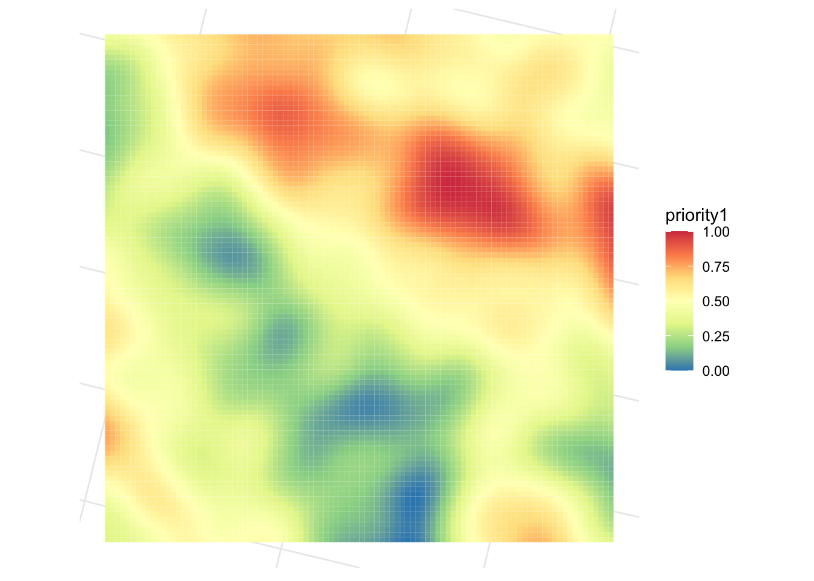
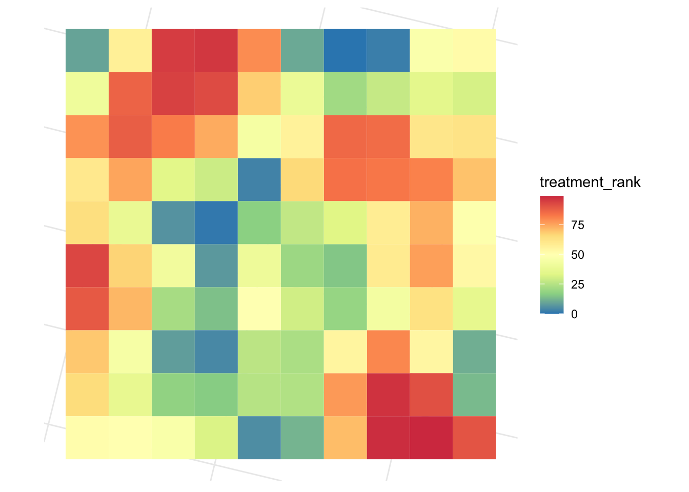

ForSysR Tutorial
================
Laurens Geffert
2022-11-03

<!-- forsys_tutotial.md is generated from forsys_tutotial.Rmd. Please edit that file -->

## ForSysR Tutorial

Here we will provide a short example showing how the forsys package can
be used to build and solve simple multi-objective landscape management
problems. For brevity, we will use one of the built-in simulated
datasets that is distributed with the package. The code is based on the
ForSysR tutorial from the GitHub README.md but contains some
modifications to the run parameters and visualisations.

Although forsys can support many different types of treatment unit data,
here our treatment units are represented as polygons in a spatial vector
format. Each polygon represents a different treatment unit.

    ## Rows: 10,000
    ## Columns: 11
    ## $ stand_id   <int> 1, 2, 3, 4, 5, 6, 7, 8, 9, 10, 11, 12, 13, 14, 15, 16, 17, …
    ## $ proj_id    <int> 1, 1, 1, 1, 1, 1, 1, 1, 1, 1, 2, 2, 2, 2, 2, 2, 2, 2, 2, 2,…
    ## $ area_ha    <dbl> 100, 100, 100, 100, 100, 100, 100, 100, 100, 100, 100, 100,…
    ## $ priority1  <dbl> 0.4174660, 0.4176290, 0.4185969, 0.4216834, 0.4279070, 0.43…
    ## $ priority2  <dbl> 0.5262852, 0.4884507, 0.4524098, 0.4198110, 0.3919413, 0.36…
    ## $ priority3  <dbl> 0.4828142, 0.4824345, 0.4817986, 0.4809131, 0.4794344, 0.47…
    ## $ priority4  <dbl> 0.5129144, 0.6461707, 0.6605746, 0.6035251, 0.6209079, 0.51…
    ## $ threshold1 <dbl> 1, 1, 1, 1, 1, 1, 1, 1, 1, 1, 1, 1, 1, 1, 1, 1, 0, 0, 0, 0,…
    ## $ threshold2 <dbl> 1, 1, 1, 1, 1, 0, 0, 0, 0, 0, 0, 1, 1, 1, 1, 1, 1, 1, 1, 1,…
    ## $ ownership  <dbl> 0, 1, 1, 1, 1, 1, 1, 1, 1, 1, 1, 1, 1, 1, 0, 0, 0, 0, 0, 0,…
    ## $ geometry   <POLYGON [m]> POLYGON ((-1805472 2690815,..., POLYGON ((-1804472 …

Let’s visualize the data

### 1 - Running a ForSys Scenario

Forsys prioritizes projects by maximizing an objective given one or more
constraints. The objectives represent one or more management priorities
while the constraints may include a maximum cost or area treated.
Thresholds are environmental or categorical conditions that trigger the
need to treat an indiviudal treatment unit or stand (e.g., a particular
ownership or minimum forest cover). Forsys then builds projects and
ranks them in order of their priority. Projects can be either predefined
units (e.g., watersheds) or can be built dynamically.

Let’s set up a very simple forsys run to see how things work. We’ll use
the test_forest data shown above. We want to find the top 2000 ha within
each predefined project based on ‘priority1’.

We run forsys with the following arguments. Remember that these can also
be run using the json config file, as described above. Forsys always
writes its outputs to csv files saved within the output folder, but we
can optionally set it to write that data out to a list which has three
elements containing the outputs.

    ## Making output directory: /Users/geffert/Planscape/analysis/code/output/test_forest_run1_simple/
    ## Forsys Shiny data detected.
    ## 
    ## 
    ## ---------------
    ## Weighting scenario 1 of 1: 1
    ## 
    ## Assuming unlimited annual target
    ## 2000 stands (20% of total) treated in 100 projects

Not surprisingly, the treatment rank of the projects selected
corresponds directly to those areas where are priority was highest, as
plotted below. Projeck rank \#1 (darkest blue) is the highest ranked

Below we plot the stands rather than the project rank and only retain
those stands that were treated.

    ## Joining, by = "stand_id"
    ## Joining, by = "proj_id"

## 2 - Multiple priorities

Next we look at multiple priorities. Plotting priorities 1 and 2 shows
that areas where priority 1 are highest tend to be lower for priority 2.

Let’s see if forsys can find locations where we can achieve both
objectives. We prioritize on both variables, priority1 and priority2. We
run forsys weighting the two objectives from 0 to 5, which results in 21
scenarios. We then filter the results to observe the outcome of the
scenario where the two objectives are equally weighted. The project rank
graph represents areas that are highest in both priorities.

You can see that the projects with the highest treatment ranks are those
where the two priorities are both high, e.g. in the bottom-right of the
planning area.

## 3 - With Thresholds

We expand on this scenario further by limiting stand selection by
ownership and threshold2. Any stands that don’t meet the criteria are
excluded.

In the plot above you can see that areas without “ownership = 2” have
been excluded altogether. The project areas that fall completely outside
of ownership2 have no stands designated for treatment. Furthermore, the
threshold2 values also influence which stands in the other project areas
are selected for treatment

## 4 - Exploring different project prioritization methods

Forsys can build projects dynamically using a package called Patchmax,
which requires some additional arguments.

    ## Running PatchMax using 11 cores
    ## 
    ## Project #1
    ##   treated area: 25000; total selected area:25100; objective value: 22358.79; constraint: ; project type: 0
    ## Project #2
    ##   treated area: 25000; total selected area:25000; objective value: 19801.37; constraint: ; project type: 0
    ## Project #3
    ##   treated area: 25000; total selected area:25000; objective value: 19704.4; constraint: ; project type: 0
    ## Project #4
    ##   treated area: 25000; total selected area:25000; objective value: 18536.88; constraint: ; project type: 0
    ## Project #5
    ##   treated area: 25000; total selected area:25100; objective value: 21466.78; constraint: ; project type: 0

You see that Patchmax created projects for us. Instead of the a-priori
defined square projects of 10x10 stands we now have dynamically created
project areas.
