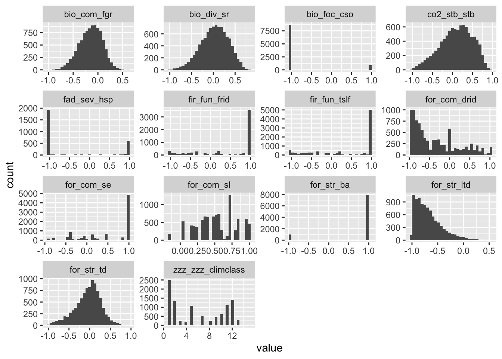
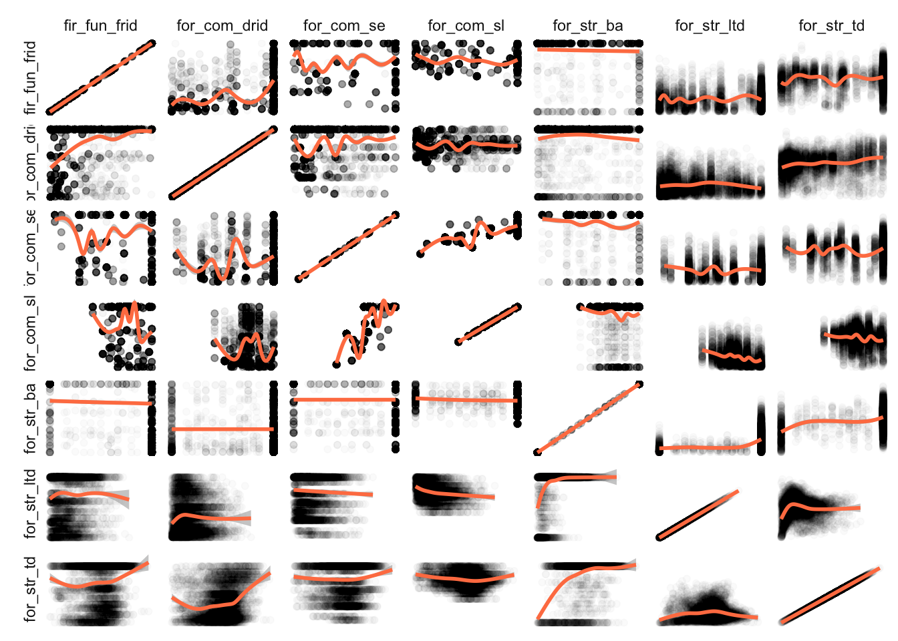
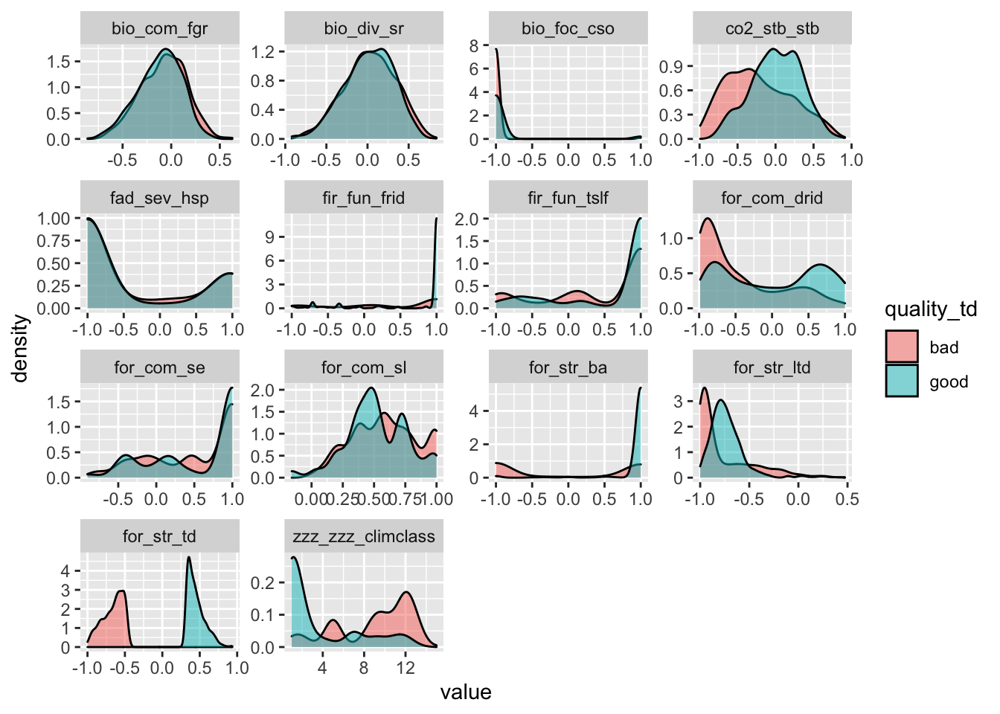
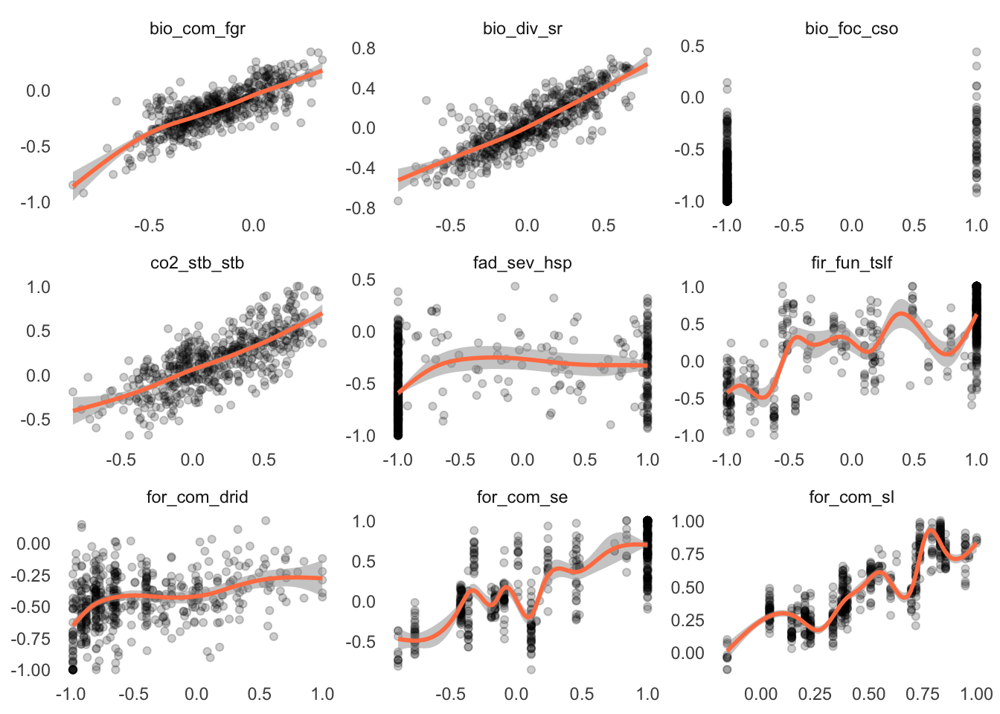

Prototype Analysis for Inferring Treatment Impact
================
Laurens Geffert
2022-11-21

<!-- impact_of_treatment.md is generated from impact_of_treatment.Rmd Please edit that file -->

    ## Linking to GEOS 3.10.2, GDAL 3.4.2, PROJ 8.2.1; sf_use_s2() is TRUE
    ## Loading required package: sp
    ## ── Attaching packages ─────────────────────────────────────── tidyverse 1.3.2 ──
    ## ✔ ggplot2 3.3.6      ✔ purrr   0.3.5 
    ## ✔ tibble  3.1.8      ✔ dplyr   1.0.10
    ## ✔ tidyr   1.2.1      ✔ stringr 1.4.1 
    ## ✔ readr   2.1.3      ✔ forcats 0.5.2 
    ## ── Conflicts ────────────────────────────────────────── tidyverse_conflicts() ──
    ## ✖ tidyr::extract() masks raster::extract()
    ## ✖ dplyr::filter()  masks stats::filter()
    ## ✖ dplyr::lag()     masks stats::lag()
    ## ✖ dplyr::select()  masks raster::select()
    ## 
    ## Attaching package: 'magrittr'
    ## 
    ## 
    ## The following object is masked from 'package:purrr':
    ## 
    ##     set_names
    ## 
    ## 
    ## The following object is masked from 'package:tidyr':
    ## 
    ##     extract
    ## 
    ## 
    ## The following object is masked from 'package:raster':
    ## 
    ##     extract
    ## 
    ## 
    ## 
    ## Attaching package: 'mice'
    ## 
    ## 
    ## The following object is masked from 'package:stats':
    ## 
    ##     filter
    ## 
    ## 
    ## The following objects are masked from 'package:base':
    ## 
    ##     cbind, rbind

We’re using TCSI data for now. The analysis should be replicated with
RRK data at a later stage. Some of the data needs some pre-processing.
Climate class is not at the same resolution and extent as the other
layers. All layers are stacked and masked to the TCSI area. Finally, we
generate a random sample of cells to keep processing times manageable.

``` r
# Using this raster as the target resolution and extent
default_raster <- raster('../data/TCSI_box/metrics/forest_structure_current_soe.tif')

resample_if_needed <- function(r, default_raster, ...) {
  if (!all(dim(r) == dim(default_raster))) {
    print(paste('resampling raster', names(r)))
    r <- raster::resample(x = r, y = default_raster, 'ngb')
  } else {
    print(paste('no need to resample', names(r)))
  }
  return(r)
}

# load all metrics
df_rasters <- tibble(
  name = c(
    'for_str_td',
    'for_str_ba',
    'for_str_ltd',
    'for_com_se',
    'for_com_sl',
    'for_com_drid',
    'fir_fun_tslf',
    'fir_fun_frid',
    'fad_sev_hsp',
    'bio_foc_cso',
    'bio_div_sr',
    'bio_com_fgr',
    'co2_stb_stb',
    'zzz_zzz_climclass'),
  path = c(
    '../data/TCSI_box/metrics/forest_structure_current_soe.tif',
    '../data/TCSI_box/metrics/baph_current.tif',
    '../data/TCSI_box/metrics/large_tree_current.tif',
    '../data/TCSI_box/metrics/seral_stage_soe_current_early.tif',
    '../data/TCSI_box/metrics/seral_stage_soe_current_late.tif',
    '../data/TCSI_box/metrics/drid_current_soe.tif',
    '../data/TCSI_box/metrics/2A2_CURRENT_Prop_Fire_Dist_FULL.tif',
    '../data/TCSI_box/metrics/frid_current_soe.tif',
    '../data/TCSI_box/metrics/9A1_prob_FLEP4.tif',
    '../data/TCSI_box/metrics/focal_species_current.tif',
    '../data/TCSI_box/metrics/species_richness_current.tif',
    '../data/TCSI_box/metrics/functional_richness_current.tif',
    '../data/TCSI_box/metrics/carbon_current.tif',
    '../data/TCSI_box/ClimateClasses/ClimateClasses.img'))

# resample if resolution or extent do not map
df_rasters %<>%
  mutate(r = path %>%
    map(.f = raster) %>%
    map2(.y = name, .f = ~set_names(.x, .y))) %>%
  mutate(r = map(r, resample_if_needed, default_raster = default_raster))
## [1] "no need to resample for_str_td"
## [1] "no need to resample for_str_ba"
## [1] "no need to resample for_str_ltd"
## [1] "resampling raster for_com_se"
## [1] "resampling raster for_com_sl"
## [1] "no need to resample for_com_drid"
## [1] "no need to resample fir_fun_tslf"
## [1] "no need to resample fir_fun_frid"
## [1] "no need to resample fad_sev_hsp"
## [1] "no need to resample bio_foc_cso"
## [1] "no need to resample bio_div_sr"
## [1] "no need to resample bio_com_fgr"
## [1] "no need to resample co2_stb_stb"
## [1] "resampling raster zzz_zzz_climclass"

# convert raster values into dataframe
x <- df_rasters %>%
  pluck('r') %>%
  stack() %>%
  values()

# create a sample that's easier to work with in memory
sierra_metrics <- c('bio_div_sr', 'bio_com_fgr', 'bio_foc_cso', 'zzz_zzz_climclass')
df <- x[sample(nrow(x), size = 1e7, replace = FALSE), ] %>%
  as_tibble() %>%
  # drop all rows that only contain NA for TCSI metrics
  filter(if_any(-one_of(sierra_metrics), ~ !is.na(.))) %>%
  # introducing sampling to speed up the code during dev TODO: take this out
  sample_n(1e4)

head(df)
## # A tibble: 6 × 14
##    for_str_td for_str_ba for_s…¹ for_c…² for_c…³ for_c…⁴ fir_f…⁵ fir_f…⁶ fad_s…⁷
##         <dbl>      <dbl>   <dbl>   <dbl>   <dbl>   <dbl>   <dbl>   <dbl>   <dbl>
## 1  0.0576            1    -0.652   0.112  0.0385 -0.0749   0.204   0.204      NA
## 2 -0.319             1    -0.739  -0.428  0.228  -0.884    1      NA          -1
## 3  0.141             1    -0.632   0.456  0.399  -0.173   -0.874  -0.874      NA
## 4  0.325             1    -0.921   0.176  0.460  -0.182    1       1          NA
## 5  0.00000739       -0.5  -0.824   1      0.793  -0.437    1      NA          -1
## 6 NA                NA    NA      -0.164  0.372  NA       NA      NA          NA
## # … with 5 more variables: bio_foc_cso <dbl>, bio_div_sr <dbl>,
## #   bio_com_fgr <dbl>, co2_stb_stb <dbl>, zzz_zzz_climclass <dbl>, and
## #   abbreviated variable names ¹​for_str_ltd, ²​for_com_se, ³​for_com_sl,
## #   ⁴​for_com_drid, ⁵​fir_fun_tslf, ⁶​fir_fun_frid, ⁷​fad_sev_hsp
```

Here we plot a histogram of the values for each metric. We’re using only
the interpreted values (range -1 to 1). You can see that some of the
variables are approximately normally distributed while others look
almost like binomial distributions.

``` r
# plot a histogram for each metric
df %>%
  pivot_longer(everything()) %>%
  filter(complete.cases(.)) %>%
  ggplot(aes(x = value)) +
  geom_histogram() +
  facet_wrap(~name, scales = 'free')
## `stat_bin()` using `bins = 30`. Pick better value with `binwidth`.
```



We can investigate correlations between metrics with a pair plot
collection of scatterplots. We’re also adding a trend line to make it
easier to spot relationships between the metrics where many observations
fall into the same value range.

``` r
df %>%
  # drop variables to save space on pair plot
  select(starts_with(c('for', 'fir'))) %>%
  select(-fir_fun_tslf) %>%
  # drop any rows with NAs
  filter(complete.cases(.)) %>%
  # self-join data to get pairs of observations
  mutate(row_id = row_number()) %>%
  pivot_longer(cols = -row_id) %>%
  full_join(., ., by = 'row_id') %>%
  # create pair plot
  ggplot( aes(x = value.x, y = value.y)) + 
  #geom_density2d_filled() +
  #scale_fill_viridis_d() +
  geom_point(alpha = .02) +
  geom_smooth(method = 'gam', alpha = .5, color = 'coral') +
  facet_grid(name.x ~ name.y, scales = 'free', switch = 'y') +
  theme_minimal() +
  theme(
    panel.grid = element_blank(),
    axis.text = element_blank(),
    axis.ticks = element_blank(),
    axis.title = element_blank())
## `geom_smooth()` using formula 'y ~ s(x, bs = "cs")'
```



To compare good and bad conditions more directly, we can restrict our
analysis to the top and bottom 10% of cell values. This allows us to see
if the distribution of other metrics changes substantially between
e.g. good tree density and bad tree density cells.

``` r


# Find areas with top 10% tree density and bottom 10% tree density,
# then look at histograms for other metrics
td_good <- df$for_str_td %>% quantile(.9, na.rm = TRUE)
td_bad <- df$for_str_td %>% quantile(.1, na.rm = TRUE)

# Drop all cells with mediocre tree density
df_quality_td <- df %>%
  mutate(quality_td = case_when(
    for_str_td >= td_good ~ 'good',
    for_str_td <= td_bad ~ 'bad',
    TRUE ~ NA_character_)) %>%
  filter(!is.na(quality_td))

# plot distribution of other metrics for good and bad tree density cells
df_quality_td %>%
  pivot_longer(-quality_td) %>%
  ggplot(aes(x = value, group = quality_td, fill = quality_td)) +
  geom_density(alpha = .5) +
  facet_wrap(~name, scales = 'free')
## Warning: Removed 2655 rows containing non-finite values (stat_density).
```



The distribution plots above are helpful to understand the relationships
between different metrics, but it is infeasible to create and visually
inspect them for all metric pairs in the dataset. Therefore, we use two
numeric values, the spearman rank correlation coefficient and the
kolmogorov-smirnov D-statistic to measure how interrelated two variables
are.

``` r

# filter data to only include top and bottom x percent for a given metric
filter_high_low <- function(df, var_name, quantile = .1) {
  
  message('\n\nsplitting by ', var_name)
  
  threshold_good <- df %>%
    pluck(var_name) %>%
    quantile(1 - quantile, na.rm = TRUE)
  threshold_bad <- df %>%
    pluck(var_name) %>%
    quantile(quantile, na.rm = TRUE)
  # over 90% of this metric are -1!
  if (var_name == 'bio_foc_cso') {
    threshold_good <- 1
  }
  df %>%
    mutate(quality = case_when(
      !!sym(var_name) >= threshold_good ~ 'good',
      !!sym(var_name) <= threshold_bad ~ 'bad',
      TRUE ~ 'neutral')) %>%
    filter(quality != 'neutral')
}

# run a kolmogorov-smirnov test to compare the distributions of one metric
# between the top and bottom value groups of another metric
ks_test <- function(df,
                    column_testing,
                    column_grouping = 'quality') {
  message('\ntesting for ', column_testing)
  out <- ks.test(
    x = df %>%
      filter(!!sym(column_grouping) == 'good') %>%
      pluck(column_testing),
    y = df %>%
      filter(!!sym(column_grouping) == 'bad') %>%
      pluck(column_testing))
  return(out)
}

# create all metric pairs
metrics <- df %>%
  select(-zzz_zzz_climclass) %>%
  colnames()
combinations <- crossing(
  metric.x = metrics,
  metric.y = metrics) %>% 
  filter(metric.x != metric.y)

# run ks-test for each metric pair
results <- combinations %>%
  mutate(ks_result = map2(
    .x = metric.x, .y = metric.y,
    .f = ~ df %>%
      filter_high_low(var_name = .x) %>%
      ks_test(column_testing = .y))) %>%
  mutate(
    spearman_cor = map2_dbl(
      .x = metric.x, .y = metric.y, 
      .f = ~ df %>%
        select(.x, .y) %>%
        filter(complete.cases(.)) %>%
        cor(method = 'spearman') %>%
        pluck(2))) %>%
  mutate(
    ks_D = map_dbl(ks_result, ~.x$statistic),
    ks_p = map_dbl(ks_result, ~.x$p.value)) %>%
  select(-ks_result)
## 
## testing for bio_div_sr
## 
## 
## splitting by bio_com_fgr
## Warning in ks.test.default(x = df %>% filter(!!sym(column_grouping) == "good")
## %>% : p-value will be approximate in the presence of ties
## 
## testing for bio_foc_cso
## 
## 
## splitting by bio_com_fgr
## Warning in ks.test.default(x = df %>% filter(!!sym(column_grouping) == "good")
## %>% : p-value will be approximate in the presence of ties
## 
## testing for co2_stb_stb
## 
## 
## splitting by bio_com_fgr
## Warning in ks.test.default(x = df %>% filter(!!sym(column_grouping) == "good")
## %>% : p-value will be approximate in the presence of ties
## 
## testing for fad_sev_hsp
## 
## 
## splitting by bio_com_fgr
## Warning in ks.test.default(x = df %>% filter(!!sym(column_grouping) == "good")
## %>% : p-value will be approximate in the presence of ties
## 
## testing for fir_fun_frid
## 
## 
## splitting by bio_com_fgr
## Warning in ks.test.default(x = df %>% filter(!!sym(column_grouping) == "good")
## %>% : p-value will be approximate in the presence of ties
## 
## testing for fir_fun_tslf
## 
## 
## splitting by bio_com_fgr
## Warning in ks.test.default(x = df %>% filter(!!sym(column_grouping) == "good")
## %>% : p-value will be approximate in the presence of ties
## 
## testing for for_com_drid
## 
## 
## splitting by bio_com_fgr
## Warning in ks.test.default(x = df %>% filter(!!sym(column_grouping) == "good")
## %>% : p-value will be approximate in the presence of ties
## 
## testing for for_com_se
## 
## 
## splitting by bio_com_fgr
## Warning in ks.test.default(x = df %>% filter(!!sym(column_grouping) == "good")
## %>% : p-value will be approximate in the presence of ties
## 
## testing for for_com_sl
## 
## 
## splitting by bio_com_fgr
## Warning in ks.test.default(x = df %>% filter(!!sym(column_grouping) == "good")
## %>% : p-value will be approximate in the presence of ties
## 
## testing for for_str_ba
## 
## 
## splitting by bio_com_fgr
## Warning in ks.test.default(x = df %>% filter(!!sym(column_grouping) == "good")
## %>% : p-value will be approximate in the presence of ties
## 
## testing for for_str_ltd
## 
## 
## splitting by bio_com_fgr
## Warning in ks.test.default(x = df %>% filter(!!sym(column_grouping) == "good")
## %>% : p-value will be approximate in the presence of ties
## 
## testing for for_str_td
## 
## 
## splitting by bio_com_fgr
## Warning in ks.test.default(x = df %>% filter(!!sym(column_grouping) == "good")
## %>% : p-value will be approximate in the presence of ties
## 
## testing for bio_com_fgr
## 
## 
## splitting by bio_div_sr
## Warning in ks.test.default(x = df %>% filter(!!sym(column_grouping) == "good")
## %>% : p-value will be approximate in the presence of ties
## 
## testing for bio_foc_cso
## 
## 
## splitting by bio_div_sr
## Warning in ks.test.default(x = df %>% filter(!!sym(column_grouping) == "good")
## %>% : p-value will be approximate in the presence of ties
## 
## testing for co2_stb_stb
## 
## 
## splitting by bio_div_sr
## Warning in ks.test.default(x = df %>% filter(!!sym(column_grouping) == "good")
## %>% : p-value will be approximate in the presence of ties
## 
## testing for fad_sev_hsp
## 
## 
## splitting by bio_div_sr
## Warning in ks.test.default(x = df %>% filter(!!sym(column_grouping) == "good")
## %>% : p-value will be approximate in the presence of ties
## 
## testing for fir_fun_frid
## 
## 
## splitting by bio_div_sr
## Warning in ks.test.default(x = df %>% filter(!!sym(column_grouping) == "good")
## %>% : p-value will be approximate in the presence of ties
## 
## testing for fir_fun_tslf
## 
## 
## splitting by bio_div_sr
## Warning in ks.test.default(x = df %>% filter(!!sym(column_grouping) == "good")
## %>% : p-value will be approximate in the presence of ties
## 
## testing for for_com_drid
## 
## 
## splitting by bio_div_sr
## Warning in ks.test.default(x = df %>% filter(!!sym(column_grouping) == "good")
## %>% : p-value will be approximate in the presence of ties
## 
## testing for for_com_se
## 
## 
## splitting by bio_div_sr
## Warning in ks.test.default(x = df %>% filter(!!sym(column_grouping) == "good")
## %>% : p-value will be approximate in the presence of ties
## 
## testing for for_com_sl
## 
## 
## splitting by bio_div_sr
## Warning in ks.test.default(x = df %>% filter(!!sym(column_grouping) == "good")
## %>% : p-value will be approximate in the presence of ties
## 
## testing for for_str_ba
## 
## 
## splitting by bio_div_sr
## Warning in ks.test.default(x = df %>% filter(!!sym(column_grouping) == "good")
## %>% : p-value will be approximate in the presence of ties
## 
## testing for for_str_ltd
## 
## 
## splitting by bio_div_sr
## Warning in ks.test.default(x = df %>% filter(!!sym(column_grouping) == "good")
## %>% : p-value will be approximate in the presence of ties
## 
## testing for for_str_td
## 
## 
## splitting by bio_div_sr
## Warning in ks.test.default(x = df %>% filter(!!sym(column_grouping) == "good")
## %>% : p-value will be approximate in the presence of ties
## 
## testing for bio_com_fgr
## 
## 
## splitting by bio_foc_cso
## Warning in ks.test.default(x = df %>% filter(!!sym(column_grouping) == "good")
## %>% : p-value will be approximate in the presence of ties
## 
## testing for bio_div_sr
## 
## 
## splitting by bio_foc_cso
## Warning in ks.test.default(x = df %>% filter(!!sym(column_grouping) == "good")
## %>% : p-value will be approximate in the presence of ties
## 
## testing for co2_stb_stb
## 
## 
## splitting by bio_foc_cso
## Warning in ks.test.default(x = df %>% filter(!!sym(column_grouping) == "good")
## %>% : p-value will be approximate in the presence of ties
## 
## testing for fad_sev_hsp
## 
## 
## splitting by bio_foc_cso
## Warning in ks.test.default(x = df %>% filter(!!sym(column_grouping) == "good")
## %>% : p-value will be approximate in the presence of ties
## 
## testing for fir_fun_frid
## 
## 
## splitting by bio_foc_cso
## Warning in ks.test.default(x = df %>% filter(!!sym(column_grouping) == "good")
## %>% : p-value will be approximate in the presence of ties
## 
## testing for fir_fun_tslf
## 
## 
## splitting by bio_foc_cso
## Warning in ks.test.default(x = df %>% filter(!!sym(column_grouping) == "good")
## %>% : p-value will be approximate in the presence of ties
## 
## testing for for_com_drid
## 
## 
## splitting by bio_foc_cso
## Warning in ks.test.default(x = df %>% filter(!!sym(column_grouping) == "good")
## %>% : p-value will be approximate in the presence of ties
## 
## testing for for_com_se
## 
## 
## splitting by bio_foc_cso
## Warning in ks.test.default(x = df %>% filter(!!sym(column_grouping) == "good")
## %>% : p-value will be approximate in the presence of ties
## 
## testing for for_com_sl
## 
## 
## splitting by bio_foc_cso
## Warning in ks.test.default(x = df %>% filter(!!sym(column_grouping) == "good")
## %>% : p-value will be approximate in the presence of ties
## 
## testing for for_str_ba
## 
## 
## splitting by bio_foc_cso
## Warning in ks.test.default(x = df %>% filter(!!sym(column_grouping) == "good")
## %>% : p-value will be approximate in the presence of ties
## 
## testing for for_str_ltd
## 
## 
## splitting by bio_foc_cso
## Warning in ks.test.default(x = df %>% filter(!!sym(column_grouping) == "good")
## %>% : p-value will be approximate in the presence of ties
## 
## testing for for_str_td
## 
## 
## splitting by bio_foc_cso
## Warning in ks.test.default(x = df %>% filter(!!sym(column_grouping) == "good")
## %>% : p-value will be approximate in the presence of ties
## 
## testing for bio_com_fgr
## 
## 
## splitting by co2_stb_stb
## Warning in ks.test.default(x = df %>% filter(!!sym(column_grouping) == "good")
## %>% : p-value will be approximate in the presence of ties
## 
## testing for bio_div_sr
## 
## 
## splitting by co2_stb_stb
## Warning in ks.test.default(x = df %>% filter(!!sym(column_grouping) == "good")
## %>% : p-value will be approximate in the presence of ties
## 
## testing for bio_foc_cso
## 
## 
## splitting by co2_stb_stb
## Warning in ks.test.default(x = df %>% filter(!!sym(column_grouping) == "good")
## %>% : p-value will be approximate in the presence of ties
## 
## testing for fad_sev_hsp
## 
## 
## splitting by co2_stb_stb
## Warning in ks.test.default(x = df %>% filter(!!sym(column_grouping) == "good")
## %>% : p-value will be approximate in the presence of ties
## 
## testing for fir_fun_frid
## 
## 
## splitting by co2_stb_stb
## Warning in ks.test.default(x = df %>% filter(!!sym(column_grouping) == "good")
## %>% : p-value will be approximate in the presence of ties
## 
## testing for fir_fun_tslf
## 
## 
## splitting by co2_stb_stb
## Warning in ks.test.default(x = df %>% filter(!!sym(column_grouping) == "good")
## %>% : p-value will be approximate in the presence of ties
## 
## testing for for_com_drid
## 
## 
## splitting by co2_stb_stb
## Warning in ks.test.default(x = df %>% filter(!!sym(column_grouping) == "good")
## %>% : p-value will be approximate in the presence of ties
## 
## testing for for_com_se
## 
## 
## splitting by co2_stb_stb
## Warning in ks.test.default(x = df %>% filter(!!sym(column_grouping) == "good")
## %>% : p-value will be approximate in the presence of ties
## 
## testing for for_com_sl
## 
## 
## splitting by co2_stb_stb
## Warning in ks.test.default(x = df %>% filter(!!sym(column_grouping) == "good")
## %>% : p-value will be approximate in the presence of ties
## 
## testing for for_str_ba
## 
## 
## splitting by co2_stb_stb
## Warning in ks.test.default(x = df %>% filter(!!sym(column_grouping) == "good")
## %>% : p-value will be approximate in the presence of ties
## 
## testing for for_str_ltd
## 
## 
## splitting by co2_stb_stb
## Warning in ks.test.default(x = df %>% filter(!!sym(column_grouping) == "good")
## %>% : p-value will be approximate in the presence of ties
## 
## testing for for_str_td
## 
## 
## splitting by co2_stb_stb
## Warning in ks.test.default(x = df %>% filter(!!sym(column_grouping) == "good")
## %>% : p-value will be approximate in the presence of ties
## 
## testing for bio_com_fgr
## 
## 
## splitting by fad_sev_hsp
## Warning in ks.test.default(x = df %>% filter(!!sym(column_grouping) == "good")
## %>% : p-value will be approximate in the presence of ties
## 
## testing for bio_div_sr
## 
## 
## splitting by fad_sev_hsp
## Warning in ks.test.default(x = df %>% filter(!!sym(column_grouping) == "good")
## %>% : p-value will be approximate in the presence of ties
## 
## testing for bio_foc_cso
## 
## 
## splitting by fad_sev_hsp
## Warning in ks.test.default(x = df %>% filter(!!sym(column_grouping) == "good")
## %>% : p-value will be approximate in the presence of ties
## 
## testing for co2_stb_stb
## 
## 
## splitting by fad_sev_hsp
## Warning in ks.test.default(x = df %>% filter(!!sym(column_grouping) == "good")
## %>% : p-value will be approximate in the presence of ties
## 
## testing for fir_fun_frid
## 
## 
## splitting by fad_sev_hsp
## 
## testing for fir_fun_tslf
## 
## 
## splitting by fad_sev_hsp
## Warning in ks.test.default(x = df %>% filter(!!sym(column_grouping) == "good")
## %>% : p-value will be approximate in the presence of ties
## 
## testing for for_com_drid
## 
## 
## splitting by fad_sev_hsp
## Warning in ks.test.default(x = df %>% filter(!!sym(column_grouping) == "good")
## %>% : p-value will be approximate in the presence of ties
## 
## testing for for_com_se
## 
## 
## splitting by fad_sev_hsp
## Warning in ks.test.default(x = df %>% filter(!!sym(column_grouping) == "good")
## %>% : p-value will be approximate in the presence of ties
## 
## testing for for_com_sl
## 
## 
## splitting by fad_sev_hsp
## Warning in ks.test.default(x = df %>% filter(!!sym(column_grouping) == "good")
## %>% : p-value will be approximate in the presence of ties
## 
## testing for for_str_ba
## 
## 
## splitting by fad_sev_hsp
## Warning in ks.test.default(x = df %>% filter(!!sym(column_grouping) == "good")
## %>% : p-value will be approximate in the presence of ties
## 
## testing for for_str_ltd
## 
## 
## splitting by fad_sev_hsp
## Warning in ks.test.default(x = df %>% filter(!!sym(column_grouping) == "good")
## %>% : p-value will be approximate in the presence of ties
## 
## testing for for_str_td
## 
## 
## splitting by fad_sev_hsp
## Warning in ks.test.default(x = df %>% filter(!!sym(column_grouping) == "good")
## %>% : p-value will be approximate in the presence of ties
## 
## testing for bio_com_fgr
## 
## 
## splitting by fir_fun_frid
## Warning in ks.test.default(x = df %>% filter(!!sym(column_grouping) == "good")
## %>% : p-value will be approximate in the presence of ties
## 
## testing for bio_div_sr
## 
## 
## splitting by fir_fun_frid
## Warning in ks.test.default(x = df %>% filter(!!sym(column_grouping) == "good")
## %>% : p-value will be approximate in the presence of ties
## 
## testing for bio_foc_cso
## 
## 
## splitting by fir_fun_frid
## Warning in ks.test.default(x = df %>% filter(!!sym(column_grouping) == "good")
## %>% : p-value will be approximate in the presence of ties
## 
## testing for co2_stb_stb
## 
## 
## splitting by fir_fun_frid
## Warning in ks.test.default(x = df %>% filter(!!sym(column_grouping) == "good")
## %>% : p-value will be approximate in the presence of ties
## 
## testing for fad_sev_hsp
## 
## 
## splitting by fir_fun_frid
## 
## testing for fir_fun_tslf
## 
## 
## splitting by fir_fun_frid
## Warning in ks.test.default(x = df %>% filter(!!sym(column_grouping) == "good")
## %>% : p-value will be approximate in the presence of ties
## 
## testing for for_com_drid
## 
## 
## splitting by fir_fun_frid
## Warning in ks.test.default(x = df %>% filter(!!sym(column_grouping) == "good")
## %>% : p-value will be approximate in the presence of ties
## 
## testing for for_com_se
## 
## 
## splitting by fir_fun_frid
## Warning in ks.test.default(x = df %>% filter(!!sym(column_grouping) == "good")
## %>% : p-value will be approximate in the presence of ties
## 
## testing for for_com_sl
## 
## 
## splitting by fir_fun_frid
## Warning in ks.test.default(x = df %>% filter(!!sym(column_grouping) == "good")
## %>% : p-value will be approximate in the presence of ties
## 
## testing for for_str_ba
## 
## 
## splitting by fir_fun_frid
## Warning in ks.test.default(x = df %>% filter(!!sym(column_grouping) == "good")
## %>% : p-value will be approximate in the presence of ties
## 
## testing for for_str_ltd
## 
## 
## splitting by fir_fun_frid
## Warning in ks.test.default(x = df %>% filter(!!sym(column_grouping) == "good")
## %>% : p-value will be approximate in the presence of ties
## 
## testing for for_str_td
## 
## 
## splitting by fir_fun_frid
## Warning in ks.test.default(x = df %>% filter(!!sym(column_grouping) == "good")
## %>% : p-value will be approximate in the presence of ties
## 
## testing for bio_com_fgr
## 
## 
## splitting by fir_fun_tslf
## Warning in ks.test.default(x = df %>% filter(!!sym(column_grouping) == "good")
## %>% : p-value will be approximate in the presence of ties
## 
## testing for bio_div_sr
## 
## 
## splitting by fir_fun_tslf
## Warning in ks.test.default(x = df %>% filter(!!sym(column_grouping) == "good")
## %>% : p-value will be approximate in the presence of ties
## 
## testing for bio_foc_cso
## 
## 
## splitting by fir_fun_tslf
## Warning in ks.test.default(x = df %>% filter(!!sym(column_grouping) == "good")
## %>% : p-value will be approximate in the presence of ties
## 
## testing for co2_stb_stb
## 
## 
## splitting by fir_fun_tslf
## Warning in ks.test.default(x = df %>% filter(!!sym(column_grouping) == "good")
## %>% : p-value will be approximate in the presence of ties
## 
## testing for fad_sev_hsp
## 
## 
## splitting by fir_fun_tslf
## Warning in ks.test.default(x = df %>% filter(!!sym(column_grouping) == "good")
## %>% : p-value will be approximate in the presence of ties
## 
## testing for fir_fun_frid
## 
## 
## splitting by fir_fun_tslf
## Warning in ks.test.default(x = df %>% filter(!!sym(column_grouping) == "good")
## %>% : p-value will be approximate in the presence of ties
## 
## testing for for_com_drid
## 
## 
## splitting by fir_fun_tslf
## Warning in ks.test.default(x = df %>% filter(!!sym(column_grouping) == "good")
## %>% : p-value will be approximate in the presence of ties
## 
## testing for for_com_se
## 
## 
## splitting by fir_fun_tslf
## Warning in ks.test.default(x = df %>% filter(!!sym(column_grouping) == "good")
## %>% : p-value will be approximate in the presence of ties
## 
## testing for for_com_sl
## 
## 
## splitting by fir_fun_tslf
## Warning in ks.test.default(x = df %>% filter(!!sym(column_grouping) == "good")
## %>% : p-value will be approximate in the presence of ties
## 
## testing for for_str_ba
## 
## 
## splitting by fir_fun_tslf
## Warning in ks.test.default(x = df %>% filter(!!sym(column_grouping) == "good")
## %>% : p-value will be approximate in the presence of ties
## 
## testing for for_str_ltd
## 
## 
## splitting by fir_fun_tslf
## Warning in ks.test.default(x = df %>% filter(!!sym(column_grouping) == "good")
## %>% : p-value will be approximate in the presence of ties
## 
## testing for for_str_td
## 
## 
## splitting by fir_fun_tslf
## Warning in ks.test.default(x = df %>% filter(!!sym(column_grouping) == "good")
## %>% : p-value will be approximate in the presence of ties
## 
## testing for bio_com_fgr
## 
## 
## splitting by for_com_drid
## Warning in ks.test.default(x = df %>% filter(!!sym(column_grouping) == "good")
## %>% : p-value will be approximate in the presence of ties
## 
## testing for bio_div_sr
## 
## 
## splitting by for_com_drid
## Warning in ks.test.default(x = df %>% filter(!!sym(column_grouping) == "good")
## %>% : p-value will be approximate in the presence of ties
## 
## testing for bio_foc_cso
## 
## 
## splitting by for_com_drid
## Warning in ks.test.default(x = df %>% filter(!!sym(column_grouping) == "good")
## %>% : p-value will be approximate in the presence of ties
## 
## testing for co2_stb_stb
## 
## 
## splitting by for_com_drid
## Warning in ks.test.default(x = df %>% filter(!!sym(column_grouping) == "good")
## %>% : p-value will be approximate in the presence of ties
## 
## testing for fad_sev_hsp
## 
## 
## splitting by for_com_drid
## Warning in ks.test.default(x = df %>% filter(!!sym(column_grouping) == "good")
## %>% : p-value will be approximate in the presence of ties
## 
## testing for fir_fun_frid
## 
## 
## splitting by for_com_drid
## Warning in ks.test.default(x = df %>% filter(!!sym(column_grouping) == "good")
## %>% : p-value will be approximate in the presence of ties
## 
## testing for fir_fun_tslf
## 
## 
## splitting by for_com_drid
## Warning in ks.test.default(x = df %>% filter(!!sym(column_grouping) == "good")
## %>% : p-value will be approximate in the presence of ties
## 
## testing for for_com_se
## 
## 
## splitting by for_com_drid
## Warning in ks.test.default(x = df %>% filter(!!sym(column_grouping) == "good")
## %>% : p-value will be approximate in the presence of ties
## 
## testing for for_com_sl
## 
## 
## splitting by for_com_drid
## Warning in ks.test.default(x = df %>% filter(!!sym(column_grouping) == "good")
## %>% : p-value will be approximate in the presence of ties
## 
## testing for for_str_ba
## 
## 
## splitting by for_com_drid
## Warning in ks.test.default(x = df %>% filter(!!sym(column_grouping) == "good")
## %>% : p-value will be approximate in the presence of ties
## 
## testing for for_str_ltd
## 
## 
## splitting by for_com_drid
## Warning in ks.test.default(x = df %>% filter(!!sym(column_grouping) == "good")
## %>% : p-value will be approximate in the presence of ties
## 
## testing for for_str_td
## 
## 
## splitting by for_com_drid
## Warning in ks.test.default(x = df %>% filter(!!sym(column_grouping) == "good")
## %>% : p-value will be approximate in the presence of ties
## 
## testing for bio_com_fgr
## 
## 
## splitting by for_com_se
## Warning in ks.test.default(x = df %>% filter(!!sym(column_grouping) == "good")
## %>% : p-value will be approximate in the presence of ties
## 
## testing for bio_div_sr
## 
## 
## splitting by for_com_se
## Warning in ks.test.default(x = df %>% filter(!!sym(column_grouping) == "good")
## %>% : p-value will be approximate in the presence of ties
## 
## testing for bio_foc_cso
## 
## 
## splitting by for_com_se
## Warning in ks.test.default(x = df %>% filter(!!sym(column_grouping) == "good")
## %>% : p-value will be approximate in the presence of ties
## 
## testing for co2_stb_stb
## 
## 
## splitting by for_com_se
## Warning in ks.test.default(x = df %>% filter(!!sym(column_grouping) == "good")
## %>% : p-value will be approximate in the presence of ties
## 
## testing for fad_sev_hsp
## 
## 
## splitting by for_com_se
## Warning in ks.test.default(x = df %>% filter(!!sym(column_grouping) == "good")
## %>% : p-value will be approximate in the presence of ties
## 
## testing for fir_fun_frid
## 
## 
## splitting by for_com_se
## Warning in ks.test.default(x = df %>% filter(!!sym(column_grouping) == "good")
## %>% : p-value will be approximate in the presence of ties
## 
## testing for fir_fun_tslf
## 
## 
## splitting by for_com_se
## Warning in ks.test.default(x = df %>% filter(!!sym(column_grouping) == "good")
## %>% : p-value will be approximate in the presence of ties
## 
## testing for for_com_drid
## 
## 
## splitting by for_com_se
## Warning in ks.test.default(x = df %>% filter(!!sym(column_grouping) == "good")
## %>% : p-value will be approximate in the presence of ties
## 
## testing for for_com_sl
## 
## 
## splitting by for_com_se
## Warning in ks.test.default(x = df %>% filter(!!sym(column_grouping) == "good")
## %>% : p-value will be approximate in the presence of ties
## 
## testing for for_str_ba
## 
## 
## splitting by for_com_se
## Warning in ks.test.default(x = df %>% filter(!!sym(column_grouping) == "good")
## %>% : p-value will be approximate in the presence of ties
## 
## testing for for_str_ltd
## 
## 
## splitting by for_com_se
## Warning in ks.test.default(x = df %>% filter(!!sym(column_grouping) == "good")
## %>% : p-value will be approximate in the presence of ties
## 
## testing for for_str_td
## 
## 
## splitting by for_com_se
## Warning in ks.test.default(x = df %>% filter(!!sym(column_grouping) == "good")
## %>% : p-value will be approximate in the presence of ties
## 
## testing for bio_com_fgr
## 
## 
## splitting by for_com_sl
## Warning in ks.test.default(x = df %>% filter(!!sym(column_grouping) == "good")
## %>% : p-value will be approximate in the presence of ties
## 
## testing for bio_div_sr
## 
## 
## splitting by for_com_sl
## Warning in ks.test.default(x = df %>% filter(!!sym(column_grouping) == "good")
## %>% : p-value will be approximate in the presence of ties
## 
## testing for bio_foc_cso
## 
## 
## splitting by for_com_sl
## Warning in ks.test.default(x = df %>% filter(!!sym(column_grouping) == "good")
## %>% : p-value will be approximate in the presence of ties
## 
## testing for co2_stb_stb
## 
## 
## splitting by for_com_sl
## Warning in ks.test.default(x = df %>% filter(!!sym(column_grouping) == "good")
## %>% : p-value will be approximate in the presence of ties
## 
## testing for fad_sev_hsp
## 
## 
## splitting by for_com_sl
## Warning in ks.test.default(x = df %>% filter(!!sym(column_grouping) == "good")
## %>% : p-value will be approximate in the presence of ties
## 
## testing for fir_fun_frid
## 
## 
## splitting by for_com_sl
## Warning in ks.test.default(x = df %>% filter(!!sym(column_grouping) == "good")
## %>% : p-value will be approximate in the presence of ties
## 
## testing for fir_fun_tslf
## 
## 
## splitting by for_com_sl
## Warning in ks.test.default(x = df %>% filter(!!sym(column_grouping) == "good")
## %>% : p-value will be approximate in the presence of ties
## 
## testing for for_com_drid
## 
## 
## splitting by for_com_sl
## Warning in ks.test.default(x = df %>% filter(!!sym(column_grouping) == "good")
## %>% : p-value will be approximate in the presence of ties
## 
## testing for for_com_se
## 
## 
## splitting by for_com_sl
## Warning in ks.test.default(x = df %>% filter(!!sym(column_grouping) == "good")
## %>% : p-value will be approximate in the presence of ties
## 
## testing for for_str_ba
## 
## 
## splitting by for_com_sl
## Warning in ks.test.default(x = df %>% filter(!!sym(column_grouping) == "good")
## %>% : p-value will be approximate in the presence of ties
## 
## testing for for_str_ltd
## 
## 
## splitting by for_com_sl
## Warning in ks.test.default(x = df %>% filter(!!sym(column_grouping) == "good")
## %>% : p-value will be approximate in the presence of ties
## 
## testing for for_str_td
## 
## 
## splitting by for_com_sl
## Warning in ks.test.default(x = df %>% filter(!!sym(column_grouping) == "good")
## %>% : p-value will be approximate in the presence of ties
## 
## testing for bio_com_fgr
## 
## 
## splitting by for_str_ba
## Warning in ks.test.default(x = df %>% filter(!!sym(column_grouping) == "good")
## %>% : p-value will be approximate in the presence of ties
## 
## testing for bio_div_sr
## 
## 
## splitting by for_str_ba
## Warning in ks.test.default(x = df %>% filter(!!sym(column_grouping) == "good")
## %>% : p-value will be approximate in the presence of ties
## 
## testing for bio_foc_cso
## 
## 
## splitting by for_str_ba
## Warning in ks.test.default(x = df %>% filter(!!sym(column_grouping) == "good")
## %>% : p-value will be approximate in the presence of ties
## 
## testing for co2_stb_stb
## 
## 
## splitting by for_str_ba
## Warning in ks.test.default(x = df %>% filter(!!sym(column_grouping) == "good")
## %>% : p-value will be approximate in the presence of ties
## 
## testing for fad_sev_hsp
## 
## 
## splitting by for_str_ba
## Warning in ks.test.default(x = df %>% filter(!!sym(column_grouping) == "good")
## %>% : p-value will be approximate in the presence of ties
## 
## testing for fir_fun_frid
## 
## 
## splitting by for_str_ba
## Warning in ks.test.default(x = df %>% filter(!!sym(column_grouping) == "good")
## %>% : p-value will be approximate in the presence of ties
## 
## testing for fir_fun_tslf
## 
## 
## splitting by for_str_ba
## Warning in ks.test.default(x = df %>% filter(!!sym(column_grouping) == "good")
## %>% : p-value will be approximate in the presence of ties
## 
## testing for for_com_drid
## 
## 
## splitting by for_str_ba
## Warning in ks.test.default(x = df %>% filter(!!sym(column_grouping) == "good")
## %>% : p-value will be approximate in the presence of ties
## 
## testing for for_com_se
## 
## 
## splitting by for_str_ba
## Warning in ks.test.default(x = df %>% filter(!!sym(column_grouping) == "good")
## %>% : p-value will be approximate in the presence of ties
## 
## testing for for_com_sl
## 
## 
## splitting by for_str_ba
## Warning in ks.test.default(x = df %>% filter(!!sym(column_grouping) == "good")
## %>% : p-value will be approximate in the presence of ties
## 
## testing for for_str_ltd
## 
## 
## splitting by for_str_ba
## Warning in ks.test.default(x = df %>% filter(!!sym(column_grouping) == "good")
## %>% : p-value will be approximate in the presence of ties
## 
## testing for for_str_td
## 
## 
## splitting by for_str_ba
## Warning in ks.test.default(x = df %>% filter(!!sym(column_grouping) == "good")
## %>% : p-value will be approximate in the presence of ties
## 
## testing for bio_com_fgr
## 
## 
## splitting by for_str_ltd
## Warning in ks.test.default(x = df %>% filter(!!sym(column_grouping) == "good")
## %>% : p-value will be approximate in the presence of ties
## 
## testing for bio_div_sr
## 
## 
## splitting by for_str_ltd
## Warning in ks.test.default(x = df %>% filter(!!sym(column_grouping) == "good")
## %>% : p-value will be approximate in the presence of ties
## 
## testing for bio_foc_cso
## 
## 
## splitting by for_str_ltd
## Warning in ks.test.default(x = df %>% filter(!!sym(column_grouping) == "good")
## %>% : p-value will be approximate in the presence of ties
## 
## testing for co2_stb_stb
## 
## 
## splitting by for_str_ltd
## Warning in ks.test.default(x = df %>% filter(!!sym(column_grouping) == "good")
## %>% : p-value will be approximate in the presence of ties
## 
## testing for fad_sev_hsp
## 
## 
## splitting by for_str_ltd
## Warning in ks.test.default(x = df %>% filter(!!sym(column_grouping) == "good")
## %>% : p-value will be approximate in the presence of ties
## 
## testing for fir_fun_frid
## 
## 
## splitting by for_str_ltd
## Warning in ks.test.default(x = df %>% filter(!!sym(column_grouping) == "good")
## %>% : p-value will be approximate in the presence of ties
## 
## testing for fir_fun_tslf
## 
## 
## splitting by for_str_ltd
## Warning in ks.test.default(x = df %>% filter(!!sym(column_grouping) == "good")
## %>% : p-value will be approximate in the presence of ties
## 
## testing for for_com_drid
## 
## 
## splitting by for_str_ltd
## Warning in ks.test.default(x = df %>% filter(!!sym(column_grouping) == "good")
## %>% : p-value will be approximate in the presence of ties
## 
## testing for for_com_se
## 
## 
## splitting by for_str_ltd
## Warning in ks.test.default(x = df %>% filter(!!sym(column_grouping) == "good")
## %>% : p-value will be approximate in the presence of ties
## 
## testing for for_com_sl
## 
## 
## splitting by for_str_ltd
## Warning in ks.test.default(x = df %>% filter(!!sym(column_grouping) == "good")
## %>% : p-value will be approximate in the presence of ties
## 
## testing for for_str_ba
## 
## 
## splitting by for_str_ltd
## Warning in ks.test.default(x = df %>% filter(!!sym(column_grouping) == "good")
## %>% : p-value will be approximate in the presence of ties
## 
## testing for for_str_td
## 
## 
## splitting by for_str_ltd
## Warning in ks.test.default(x = df %>% filter(!!sym(column_grouping) == "good")
## %>% : p-value will be approximate in the presence of ties
## 
## testing for bio_com_fgr
## 
## 
## splitting by for_str_td
## Warning in ks.test.default(x = df %>% filter(!!sym(column_grouping) == "good")
## %>% : p-value will be approximate in the presence of ties
## 
## testing for bio_div_sr
## 
## 
## splitting by for_str_td
## Warning in ks.test.default(x = df %>% filter(!!sym(column_grouping) == "good")
## %>% : p-value will be approximate in the presence of ties
## 
## testing for bio_foc_cso
## 
## 
## splitting by for_str_td
## Warning in ks.test.default(x = df %>% filter(!!sym(column_grouping) == "good")
## %>% : p-value will be approximate in the presence of ties
## 
## testing for co2_stb_stb
## 
## 
## splitting by for_str_td
## Warning in ks.test.default(x = df %>% filter(!!sym(column_grouping) == "good")
## %>% : p-value will be approximate in the presence of ties
## 
## testing for fad_sev_hsp
## 
## 
## splitting by for_str_td
## Warning in ks.test.default(x = df %>% filter(!!sym(column_grouping) == "good")
## %>% : p-value will be approximate in the presence of ties
## 
## testing for fir_fun_frid
## 
## 
## splitting by for_str_td
## Warning in ks.test.default(x = df %>% filter(!!sym(column_grouping) == "good")
## %>% : p-value will be approximate in the presence of ties
## 
## testing for fir_fun_tslf
## 
## 
## splitting by for_str_td
## Warning in ks.test.default(x = df %>% filter(!!sym(column_grouping) == "good")
## %>% : p-value will be approximate in the presence of ties
## 
## testing for for_com_drid
## 
## 
## splitting by for_str_td
## Warning in ks.test.default(x = df %>% filter(!!sym(column_grouping) == "good")
## %>% : p-value will be approximate in the presence of ties
## 
## testing for for_com_se
## 
## 
## splitting by for_str_td
## Warning in ks.test.default(x = df %>% filter(!!sym(column_grouping) == "good")
## %>% : p-value will be approximate in the presence of ties
## 
## testing for for_com_sl
## 
## 
## splitting by for_str_td
## Warning in ks.test.default(x = df %>% filter(!!sym(column_grouping) == "good")
## %>% : p-value will be approximate in the presence of ties
## 
## testing for for_str_ba
## 
## 
## splitting by for_str_td
## Warning in ks.test.default(x = df %>% filter(!!sym(column_grouping) == "good")
## %>% : p-value will be approximate in the presence of ties
## 
## testing for for_str_ltd
## 
## 
## splitting by for_str_td
## Warning in ks.test.default(x = df %>% filter(!!sym(column_grouping) == "good")
## %>% : p-value will be approximate in the presence of ties
## Warning: Using an external vector in selections was deprecated in tidyselect 1.1.0.
## ℹ Please use `all_of()` or `any_of()` instead.
##   # Was:
##   data %>% select(.x)
## 
##   # Now:
##   data %>% select(all_of(.x))
## 
## See <https://tidyselect.r-lib.org/reference/faq-external-vector.html>.
## Warning: Using an external vector in selections was deprecated in tidyselect 1.1.0.
## ℹ Please use `all_of()` or `any_of()` instead.
##   # Was:
##   data %>% select(.y)
## 
##   # Now:
##   data %>% select(all_of(.y))
## 
## See <https://tidyselect.r-lib.org/reference/faq-external-vector.html>.

results %>%
  arrange(ks_p, desc(ks_D))
## # A tibble: 156 × 5
##    metric.x     metric.y     spearman_cor  ks_D  ks_p
##    <chr>        <chr>               <dbl> <dbl> <dbl>
##  1 fir_fun_frid fir_fun_tslf        1     1         0
##  2 fir_fun_tslf fir_fun_frid        1     1         0
##  3 for_com_sl   for_com_se          0.735 1         0
##  4 bio_div_sr   bio_com_fgr         0.860 0.998     0
##  5 for_com_se   for_com_sl          0.735 0.998     0
##  6 bio_com_fgr  bio_div_sr          0.860 0.995     0
##  7 co2_stb_stb  for_str_ltd         0.552 0.774     0
##  8 for_str_ltd  co2_stb_stb         0.552 0.707     0
##  9 for_com_drid fir_fun_tslf        0.462 0.699     0
## 10 for_com_drid fir_fun_frid        0.513 0.698     0
## # … with 146 more rows

write.csv(results,file = 'output/cor.csv')
```

We can try to use the relationships between the metrics to predict the
likely value of a metric AFTER treatment, given the values of the
metrics BEFORE treatment as well as the value of some selected metrics
that we know will change to a specific value as the DIRECT result of
landscape treatment.

Here, we assume that *basal area*, *tree density*, and *large tree
density* may be changed as a direct result of landscape treatment.
*Climate class* will always remain unchanged. All other metrics may
change as an indirect result of treatment. We will try to estimate these
direct impacts using a machine learning approach. Specifically, we can
use multiple linear model imputation from the `mice` package to achieve
this.

Let’s test this below:

``` r

df_imputation <- df %>%
  # convert climate class to factor so it can be used for imputation
  mutate(climclass = as.factor(zzz_zzz_climclass)) %>%
  select(-zzz_zzz_climclass) %>%
  # drop collinear metric
  select(-fir_fun_frid) %>%
  # drop incomplete cases for now
  filter(complete.cases(.))

# these variables will not change and therefore should not be masked / imputed
exclude <- c('climclass', 'for_str_td', 'for_str_ba', 'for_str_ltd')

# Drops random fields from metrics data frame. Returns masked data frame and an
# index list with the row + col indices of the values that were dropped
drop_random_values <- function(
    df,
    exclude = c('climclass', 'for_str_td', 'for_str_ba', 'for_str_ltd'),
    p = .2,
    seed = 42) {
  set.seed(seed)
  # drop columns that are excluded from sampling
  excluded <- df[, exclude]
  df <- select(df, -all_of(!!exclude))
  # sample of random rows with given probability
  sample_mask <- tibble(.rows = nrow(df))
  for (i in colnames(df)) {
    i_mask <- rbinom(nrow(df), 1, p)
    sample_mask <- sample_mask %>%
      {. == 1} %>%
      bind_cols(i_mask) %>%
      set_names(c(colnames(sample_mask), i))
    df[i_mask == 1, i] <- NA
  }
  df <- bind_cols(df, excluded)
  return(list(df, sample_mask))
}

# drop some random cells
c(df_masked, sample_mask) %<-% drop_random_values(df_imputation, p = .2)
## New names:
## New names:
## New names:
## New names:
## New names:
## New names:
## New names:
## New names:
## New names:
## • `` -> `...1`
# compare NAs in masked data to the original, and to the sample mask.
# Should all be TRUE! (unless original data contained NAs)
all((is.na(df_masked) & !is.na(df_imputation)) == sample_mask)
## [1] TRUE

# start mice setup
ini <- mice(
  data = df_masked,
  # find metrics with minimum correlation for prediction
  pred = quickpred(df_masked, mincor = .1),
  maxit = 0)
# specify post-processing logic for mice
# since interpreted values should fall within [-1, 1] range.
# see https://www.gerkovink.com/miceVignettes/Passive_Post_processing/Passive_imputation_post_processing.html for details
post_processing <- ini$post
post_processing_logic <- 'imp[[j]][, i] <- squeeze(imp[[j]][, i], c(-1, 1))'
post_processing[1:length(post_processing)-1] <- post_processing_logic

# specify prediction relationship.
pred <- ini$predictorMatrix
# always use climate class
pred[, 'climclass'] <- 1

# fit imputation model
imputation <- mice(
  data = df_masked,
  method = 'norm.predict',
  post = post_processing,
  m = 1,
  maxit = 10,
  seed = 42,
  print = FALSE)
## Warning: Number of logged events: 90
# run actual imputation
df_completed <- imputation %>%
  complete() %>%
  tibble()

df_comparison <- tibble()
for (i in colnames(df_completed)) {
  if (!i %in% exclude) {
    # find values that were removed
    gaps <- is.na(df_masked[[i]]) & !is.na(df_imputation[[i]])
    x_i <- tibble(
      variable = i,
      predicted = df_completed[[i]][gaps],
      actual = df_imputation[[i]][gaps])
    df_comparison <- bind_rows(df_comparison, x_i)
  }
}

# check correlation between predicted and actual values
out_correlation <- df_comparison %>%
  #filter(complete.cases(.)) %>%
  select(predicted, actual) %>%
  {cor(., method = 'spearman')[[2]]}
out_correlation
## [1] 0.7710269

# show density plot
df_comparison %>%
  ggplot(aes(x = actual, y = predicted)) +
  geom_point(alpha = 0.2) +
  #geom_density2d_filled() +
  geom_smooth(method = 'gam', alpha = .5, color = 'coral') +
  facet_wrap(~ variable, scales = 'free') +
  theme_minimal() +
  theme(
    panel.grid = element_blank(),
    # axis.text = element_blank(),
    # axis.ticks = element_blank(),
    axis.title = element_blank())
## `geom_smooth()` using formula 'y ~ s(x, bs = "cs")'
## Warning: Computation failed in `stat_smooth()`:
## x has insufficient unique values to support 10 knots: reduce k.
```



The results look promising for some metrics, like *functional group
richness* and *carbon stability* but less sensible for others such as
*probability of high severity fires*.

We need to add one more step to our approach: We want to model the
likely values of metrics after treatment. Direct impact will be
simulated by moving the metrics tree density and basal area, indirect
impacts need to be estimated by the model. However, we can use the
values of the metric prior to treatment for our estimates, because
e.g. areas with low probability of severe fires will still have a low
severity afterwards, probably even lower!

That means we can use the pre-treatment values in our estimation, and we
can also include the knowledge on directionality (e.g. probability of
high severity fires will remain the same or decrease).

``` r
# identify potential treatment rows via undesireable conditions
# in directly impacted metrics
archetype <- df_imputation %>%
  mutate(archetype = for_str_td > 0 & for_str_ba == 1) %>%
  pluck('archetype')

# static variables that don't change due to treatment
df_static <- df_imputation %>%
  select(climclass)
# pre-treatment conditions
df_pretreat <- df_imputation %>%
  select(-climclass) %>%
  set_colnames(paste0('pretreat_', colnames(.)))
# create table for post treatment values
df_posttreat <- df_imputation %>%
  select(-climclass) %>%
  set_colnames(paste0('posttreat_', colnames(.)))

direct_metrics <- c(
  'pretreat_for_str_td', 'pretreat_for_str_ba',
  'posttreat_for_str_td', 'posttreat_for_str_ba')
indirect_metrics <- c(
  colnames(df_pretreat),
  colnames(df_posttreat)) %>%
  setdiff(direct_metrics)

# set indirect metrics in  stands with desireable forest structure variables
# to NA in pre-treatment
df_pretreat[archetype, colnames(df_pretreat) %in% indirect_metrics] <- NA
# set indirect metrics in treatment stands to NA in post-treatment
df_posttreat[!archetype, colnames(df_posttreat) %in% indirect_metrics] <- NA
# set post treatment direct metrics in treatment stands to desired conditions
df_posttreat[!archetype, 'posttreat_for_str_td'] <- .1
df_posttreat[!archetype, 'posttreat_for_str_ba'] <- 1

# combine the tables
df_prediction <- bind_cols(df_static, df_pretreat, df_posttreat)

# start mice setup
ini <- mice(
  # use the full dataset instead this time
  data = df_prediction,
  # find metrics with minimum correlation for prediction
  pred = quickpred(df_prediction, mincor = .1),
  maxit = 0,
  remove.collinear = FALSE,
  print = FALSE)

# specify prediction relationship.
pred <- ini$predictorMatrix
# always use climate class
pred[, 'climclass'] <- 1

# specify post-processing logic for mice
adjust_iv <- function(imp, i, j) {
  squeeze(imp[[j]][, i], c(-1, 1))
}
post_processing <- ini$post
post_processing_logic <- 'imp[[j]][, i] <- adjust_iv(imp, i, j)'
post_processing[1:length(post_processing)-1] <- post_processing_logic

# run actual imputation
imputation <- mice(
  data = df_prediction,
  method = 'norm.predict',
  pred = pred,
  post = post_processing,
  m = 1,
  maxit = 10,
  seed = 42,
  remove.collinear = FALSE,
  print = FALSE)
## Warning: Number of logged events: 200
df_completed <- imputation %>%
  complete() %>%
  tibble()

df_completed %>%
  # drop archetype rows
  filter(imputation$where[, 14:25] %>% rowSums == 10) %>%
  select(starts_with('posttreat')) %>%
  bind_rows(df_pretreat) %>%
  pivot_longer(everything()) %>%
  mutate(
    post = case_when(
      str_detect(name, '^post') ~ 'post treatment',
      TRUE ~ 'pre treatment'),
    name = name %>% str_remove('pretreat_') %>% str_remove('posttreat_')) %>%
  # TODO: remove
  filter(complete.cases(.)) %>%
  pivot_wider(
    names_from = post,
    values_from = value,
    values_fn = list(value = mean)) %>%
  select(name, `pre treatment`, `post treatment`) %>%
  mutate(delta = `post treatment` - `pre treatment`)
## # A tibble: 12 × 4
##    name         `pre treatment` `post treatment`    delta
##    <chr>                  <dbl>            <dbl>    <dbl>
##  1 for_str_td           -0.0636           0.1     0.164  
##  2 for_str_ba            0.779            1       0.221  
##  3 for_str_ltd          -0.713           -0.693   0.0207 
##  4 for_com_se            0.308            0.320   0.0122 
##  5 for_com_sl            0.503            0.492  -0.0104 
##  6 for_com_drid         -0.473           -0.468   0.00527
##  7 fir_fun_tslf          0.332            0.329  -0.00316
##  8 fad_sev_hsp          -0.476           -0.504  -0.0277 
##  9 bio_foc_cso          -0.867           -0.739   0.128  
## 10 bio_div_sr            0.0289           0.0378  0.00886
## 11 bio_com_fgr          -0.159           -0.173  -0.0134 
## 12 co2_stb_stb           0.0913           0.172   0.0803
```

To be honest, the results don’t seem to make a lot of sense. *carbon*
has increased when it surely should have gone down due to removal of
biomass, most other metrics have declined. I think the problem may be
that we only presented the archetype cells as “labelled data” to the
model, thus inducing bias into our forecast.

Let’s try instead to use all stands as labeled data.

``` r

# df_rf <- tibble(
#   metric = df_imputation |> select(-climclass) %>% colnames(),
#   X = list(df_imputation)) |>
#   mutate(
#     y = map2(.x = X, .y = metric, .f = ~pluck(.x, .y)),
#     X = map2(.x = X, .y = metric, .f = ~select(.x, -.y)))
# 
# library(randomForest)
# library(glmnet)
# library(broom)
# 
# df_rf <- df_rf %>%
#   mutate(
#     glmnet = map2(X, y, ~cv.glmnet(.x[[1]], .y[[1]])))
# #    rf = map2(X, y, ~randomForest(.x, .y)))
# 
# df_rf <- df_rf %>%
#   mutate(
#     stats_glm = map(glmnet, tidy))
# 
# cv.glmnet(
#   x = as.matrix(df_rf$X[[10]]),
#   y = df_rf$y[[10]],
#   type.measure = 'mse')
# # 
# # ?randomForest
# # df_imputation
  
```

``` r

# 
# # don't predict basal area, tree density, large tree density, or climate class
# # because these will be set manually
# pred[c(
#   'for_str_td',
#   'for_str_ba',
#   'for_str_ltd',
#   'climclass'), ] <- 0
# # don't use any of the indirectly impacted metrics
# # because they might interact with one-another
# pred[, c(
#  'for_com_se',
#  'for_com_sl',
#  'for_com_drid',
#  'fir_fun_tslf',
#  'fad_sev_hsp',
#  'bio_foc_cso',
#  'bio_div_sr',
#  'bio_com_fgr',
#  'co2_stb_stb')] <- 0
# 
```
