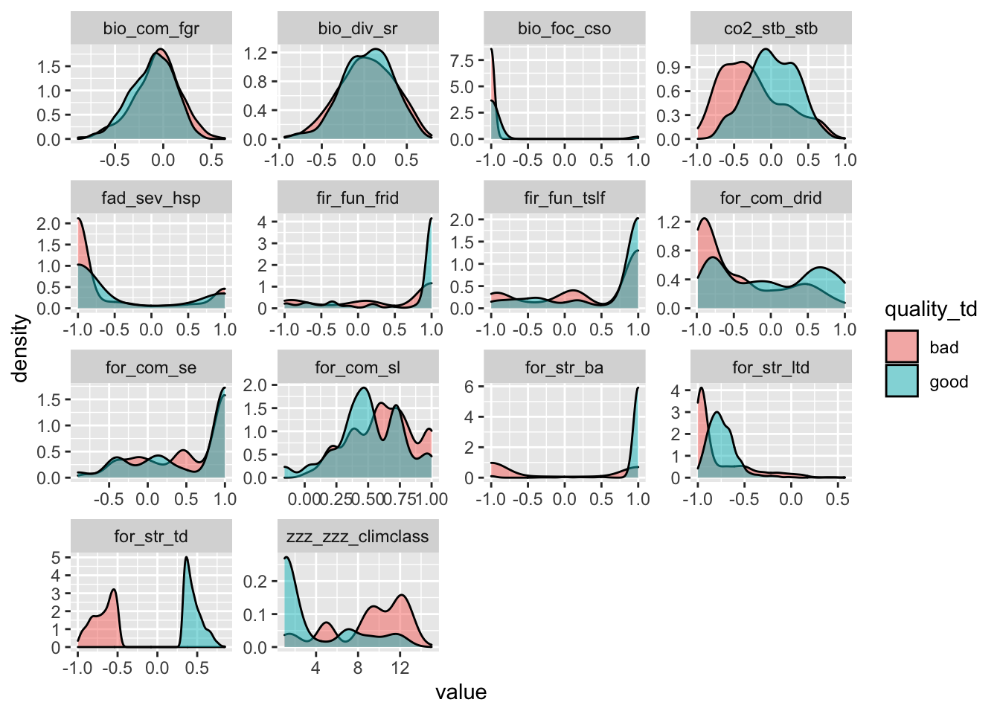

Prototype Analysis for Inferring Treatment Impact
================
Laurens Geffert
2022-11-21

<!-- impact_of_treatment.md is generated from impact_of_treatment.Rmd Please edit that file -->

``` r
library(sf)
## Linking to GEOS 3.10.2, GDAL 3.4.2, PROJ 8.2.1; sf_use_s2() is TRUE
library(raster)
## Loading required package: sp
library(tidyverse)
## ── Attaching packages
## ───────────────────────────────────────
## tidyverse 1.3.2 ──
## ✔ ggplot2 3.3.6      ✔ purrr   0.3.5 
## ✔ tibble  3.1.8      ✔ dplyr   1.0.10
## ✔ tidyr   1.2.1      ✔ stringr 1.4.1 
## ✔ readr   2.1.3      ✔ forcats 0.5.2 
## ── Conflicts ────────────────────────────────────────── tidyverse_conflicts() ──
## ✖ tidyr::extract() masks raster::extract()
## ✖ dplyr::filter()  masks stats::filter()
## ✖ dplyr::lag()     masks stats::lag()
## ✖ dplyr::select()  masks raster::select()
library(magrittr)
## 
## Attaching package: 'magrittr'
## 
## The following object is masked from 'package:purrr':
## 
##     set_names
## 
## The following object is masked from 'package:tidyr':
## 
##     extract
## 
## The following object is masked from 'package:raster':
## 
##     extract
library(purrr)
library(zeallot)
library(mice)
## 
## Attaching package: 'mice'
## 
## The following object is masked from 'package:stats':
## 
##     filter
## 
## The following objects are masked from 'package:base':
## 
##     cbind, rbind
```

``` r
# Using this raster as the target resolution and extent
default_raster <- raster('../data/TCSI_box/metrics/forest_structure_current_soe.tif')

resample_if_needed <- function(r, default_raster, ...) {
  if (!all(dim(r) == dim(default_raster))) {
    print(paste('resampling raster', names(r)))
    r <- raster::resample(x = r, y = default_raster, 'ngb')
  } else {
    print(paste('no need to resample', names(r)))
  }
  return(r)
}

# load all metrics
df_rasters <- tibble(
  name = c(
    'for_str_td',
    'for_str_ba',
    'for_str_ltd',
    'for_com_se',
    'for_com_sl',
    'for_com_drid',
    'fir_fun_tslf',
    'fir_fun_frid',
    'fad_sev_hsp',
    'bio_foc_cso',
    'bio_div_sr',
    'bio_com_fgr',
    'co2_stb_stb',
    'zzz_zzz_climclass'),
  path = c(
    '../data/TCSI_box/metrics/forest_structure_current_soe.tif',
    '../data/TCSI_box/metrics/baph_current.tif',
    '../data/TCSI_box/metrics/large_tree_current.tif',
    '../data/TCSI_box/metrics/seral_stage_soe_current_early.tif',
    '../data/TCSI_box/metrics/seral_stage_soe_current_late.tif',
    '../data/TCSI_box/metrics/drid_current_soe.tif',
    '../data/TCSI_box/metrics/2A2_CURRENT_Prop_Fire_Dist_FULL.tif',
    '../data/TCSI_box/metrics/frid_current_soe.tif',
    '../data/TCSI_box/metrics/9A1_prob_FLEP4.tif',
    '../data/TCSI_box/metrics/focal_species_current.tif',
    '../data/TCSI_box/metrics/species_richness_current.tif',
    '../data/TCSI_box/metrics/functional_richness_current.tif',
    '../data/TCSI_box/metrics/carbon_current.tif',
    '../data/TCSI_box/ClimateClasses/ClimateClasses.img'))

# resample if resolution or extent do not map
df_rasters %<>%
  mutate(r = path %>%
    map(.f = raster) %>%
    map2(.y = name, .f = ~set_names(.x, .y))) %>%
  mutate(r = map(r, resample_if_needed, default_raster = default_raster))
## [1] "no need to resample for_str_td"
## [1] "no need to resample for_str_ba"
## [1] "no need to resample for_str_ltd"
## [1] "resampling raster for_com_se"
## [1] "resampling raster for_com_sl"
## [1] "no need to resample for_com_drid"
## [1] "no need to resample fir_fun_tslf"
## [1] "no need to resample fir_fun_frid"
## [1] "no need to resample fad_sev_hsp"
## [1] "no need to resample bio_foc_cso"
## [1] "no need to resample bio_div_sr"
## [1] "no need to resample bio_com_fgr"
## [1] "no need to resample co2_stb_stb"
## [1] "resampling raster zzz_zzz_climclass"

# convert raster values into dataframe
x <- df_rasters %>%
  pluck('r') %>%
  stack() %>%
  values()

# create a sample that's easier to work with in memory
sierra_metrics <- c('bio_div_sr', 'bio_com_fgr', 'bio_foc_cso', 'zzz_zzz_climclass')
df <- x[sample(nrow(x), size = 1e7, replace = FALSE), ] %>%
  as_tibble() %>%
  # drop all rows that only contain NA for TCSI metrics
  filter(if_any(-one_of(sierra_metrics), ~ !is.na(.))) %>%
  # introducing sampling to speed up the code during dev TODO: take this out
  sample_n(1e4)

summary(df)
##    for_str_td        for_str_ba       for_str_ltd        for_com_se     
##  Min.   :-0.9979   Min.   :-1.0000   Min.   :-1.0000   Min.   :-0.9040  
##  1st Qu.:-0.2181   1st Qu.: 1.0000   1st Qu.:-0.8790   1st Qu.:-0.0920  
##  Median :-0.0021   Median : 1.0000   Median :-0.7347   Median : 1.0000  
##  Mean   :-0.0419   Mean   : 0.7236   Mean   :-0.6778   Mean   : 0.4836  
##  3rd Qu.: 0.1693   3rd Qu.: 1.0000   3rd Qu.:-0.5403   3rd Qu.: 1.0000  
##  Max.   : 0.8483   Max.   : 1.0000   Max.   : 0.6689   Max.   : 1.0000  
##  NA's   :556       NA's   :556       NA's   :556       NA's   :450      
##    for_com_sl       for_com_drid      fir_fun_tslf      fir_fun_frid   
##  Min.   :-0.1585   Min.   :-0.9857   Min.   :-1.0000   Min.   :-1.000  
##  1st Qu.: 0.3331   1st Qu.:-0.8354   1st Qu.:-0.3581   1st Qu.:-0.358  
##  Median : 0.5080   Median :-0.6005   Median : 1.0000   Median : 1.000  
##  Mean   : 0.5179   Mean   :-0.3706   Mean   : 0.3778   Mean   : 0.399  
##  3rd Qu.: 0.7171   3rd Qu.: 0.0143   3rd Qu.: 1.0000   3rd Qu.: 1.000  
##  Max.   : 1.0000   Max.   : 1.0000   Max.   : 1.0000   Max.   : 1.000  
##  NA's   :450       NA's   :1045      NA's   :590       NA's   :3489    
##   fad_sev_hsp      bio_foc_cso        bio_div_sr       bio_com_fgr     
##  Min.   :-1.000   Min.   :-1.0000   Min.   :-0.9882   Min.   :-0.9456  
##  1st Qu.:-1.000   1st Qu.:-1.0000   1st Qu.:-0.1671   1st Qu.:-0.2880  
##  Median :-1.000   Median :-1.0000   Median : 0.0543   Median :-0.1196  
##  Mean   :-0.463   Mean   :-0.8056   Mean   : 0.0377   Mean   :-0.1369  
##  3rd Qu.: 0.242   3rd Qu.:-1.0000   3rd Qu.: 0.2643   3rd Qu.: 0.0229  
##  Max.   : 1.000   Max.   : 1.0000   Max.   : 0.8466   Max.   : 0.6394  
##  NA's   :7072     NA's   :343       NA's   :343       NA's   :343      
##   co2_stb_stb      zzz_zzz_climclass
##  Min.   :-1.0000   Min.   :  1.000  
##  1st Qu.:-0.1889   1st Qu.:  2.000  
##  Median : 0.1267   Median :  5.000  
##  Mean   : 0.0931   Mean   :  6.218  
##  3rd Qu.: 0.4065   3rd Qu.: 11.000  
##  Max.   : 0.9934   Max.   :128.000  
##  NA's   :477
```

``` r
# plot a histogram for each metric
df %>%
  pivot_longer(everything()) %>%
  ggplot(aes(x = value)) +
  geom_histogram() +
  facet_wrap(~name, scales = 'free')
## `stat_bin()` using `bins = 30`. Pick better value with `binwidth`.
## Warning: Removed 16270 rows containing non-finite values (stat_bin).
```


``` r
#' Next steps:
#' - plot histograms for other metrics comparing 1 and -1 for tree density
#' - create pairs plot for metrics to check for correlation
#' - create top decile analysis and look at distribution changes for each metric
#' - look at IV by climate class


# Find areas with top 10% tree density and bottom 10% tree density,
# then look at histograms for other metrics
td_good <- df$for_str_td %>% quantile(.9, na.rm = TRUE)
td_bad <- df$for_str_td %>% quantile(.1, na.rm = TRUE)

# Drop all cells with mediocre tree density
df_quality_td <- df %>%
  mutate(quality_td = case_when(
    for_str_td >= td_good ~ 'good',
    for_str_td <= td_bad ~ 'bad',
    TRUE ~ NA_character_)) %>%
  filter(!is.na(quality_td))

# plot distribution of other metrics for good and bad tree density cells
df_quality_td %>%
  pivot_longer(-quality_td) %>%
  ggplot(aes(x = value, group = quality_td, fill = quality_td)) +
  geom_density(alpha = .5) +
  facet_wrap(~name, scales = 'free')
## Warning: Removed 2635 rows containing non-finite values (stat_density).
```



``` r
# run a kolmogorov-smirnov test to compare the distribution of one other metric
ks_test <- function(df,
                    column_grouping,
                    column_testing) {
  message('\n\nks-testing ', column_testing)
  out <- ks.test(
    x = df %>%
      filter({{ column_grouping }} == 'good') %>%
      pluck(column_testing),
    y = df %>%
      filter({{column_grouping}} == 'bad') %>%
      pluck(column_testing))
  return(out)
}

# run ks-test for each metric
results <- tibble(var_names = colnames(df)[-1]) %>%
  mutate(ks_result = map(
    .x = var_names,
    .f = ~ks_test(df_quality_td, quality_td, .x))) %>%
  mutate(
    ks_D = map_dbl(ks_result, ~.x$statistic),
    ks_p = map_dbl(ks_result, ~.x$p.value))
## 
## 
## ks-testing for_str_ba
## Warning in ks.test.default(x = df %>% filter({: p-value will be approximate in
## the presence of ties
## 
## 
## ks-testing for_str_ltd
## Warning in ks.test.default(x = df %>% filter({: p-value will be approximate in
## the presence of ties
## 
## 
## ks-testing for_com_se
## Warning in ks.test.default(x = df %>% filter({: p-value will be approximate in
## the presence of ties
## 
## 
## ks-testing for_com_sl
## Warning in ks.test.default(x = df %>% filter({: p-value will be approximate in
## the presence of ties
## 
## 
## ks-testing for_com_drid
## Warning in ks.test.default(x = df %>% filter({: p-value will be approximate in
## the presence of ties
## 
## 
## ks-testing fir_fun_tslf
## Warning in ks.test.default(x = df %>% filter({: p-value will be approximate in
## the presence of ties
## 
## 
## ks-testing fir_fun_frid
## Warning in ks.test.default(x = df %>% filter({: p-value will be approximate in
## the presence of ties
## 
## 
## ks-testing fad_sev_hsp
## Warning in ks.test.default(x = df %>% filter({: p-value will be approximate in
## the presence of ties
## 
## 
## ks-testing bio_foc_cso
## Warning in ks.test.default(x = df %>% filter({: p-value will be approximate in
## the presence of ties
## 
## 
## ks-testing bio_div_sr
## Warning in ks.test.default(x = df %>% filter({: p-value will be approximate in
## the presence of ties
## 
## 
## ks-testing bio_com_fgr
## Warning in ks.test.default(x = df %>% filter({: p-value will be approximate in
## the presence of ties
## 
## 
## ks-testing co2_stb_stb
## Warning in ks.test.default(x = df %>% filter({: p-value will be approximate in
## the presence of ties
## 
## 
## ks-testing zzz_zzz_climclass
## Warning in ks.test.default(x = df %>% filter({: p-value will be approximate in
## the presence of ties

results %>%
  select(-ks_result) %>%
  arrange(desc(ks_D))
## # A tibble: 13 × 3
##    var_names           ks_D     ks_p
##    <chr>              <dbl>    <dbl>
##  1 for_str_ba        0.589  0       
##  2 zzz_zzz_climclass 0.588  0       
##  3 for_str_ltd       0.490  0       
##  4 co2_stb_stb       0.366  0       
##  5 for_com_drid      0.282  0       
##  6 for_com_sl        0.261  0       
##  7 fir_fun_frid      0.211  2.73e-14
##  8 fir_fun_tslf      0.163  2.67e-11
##  9 for_com_se        0.107  7.40e- 5
## 10 bio_com_fgr       0.0991 2.86e- 4
## 11 fad_sev_hsp       0.0736 5.98e- 1
## 12 bio_div_sr        0.0560 1.19e- 1
## 13 bio_foc_cso       0.0429 3.77e- 1
```
